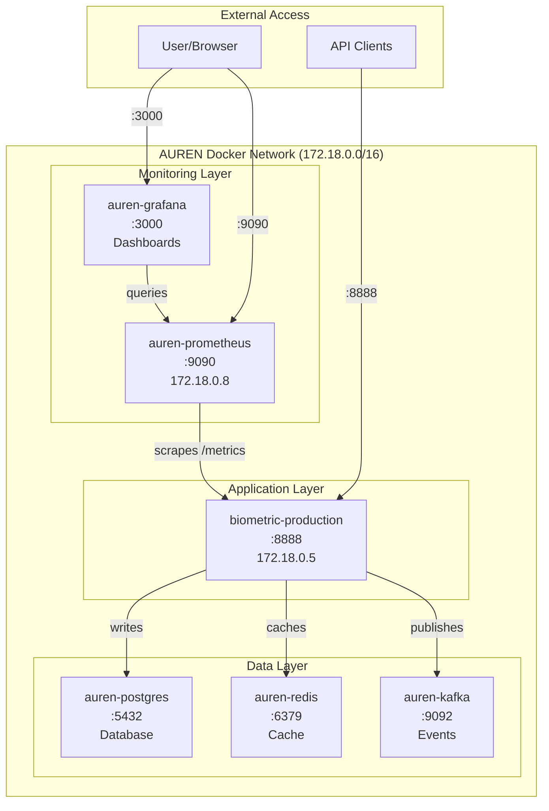
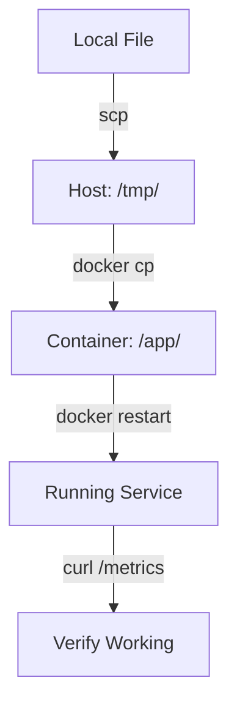

# AUREN DOCKER INFRASTRUCTURE NAVIGATION GUIDE

**Created**: January 28, 2025  
**Author**: Senior Engineer  
**Version**: 1.0  
**Purpose**: Complete guide to navigating AUREN's Docker infrastructure

---

## 🗺️ Container Navigation Map

```
AUREN Docker Infrastructure (172.18.0.0/16 network)
│
├── biometric-production (172.18.0.5)
│   ├── Port: 8888
│   ├── Image: auren/biometric-complete:latest
│   ├── Command: python complete_biometric_system.py
│   ├── Key Files:
│   │   ├── /app/complete_biometric_system.py (main application)
│   │   ├── /app/api.py (alternative API file)
│   │   └── /app/api_metrics_fix.py (metrics implementation)
│   └── Health Check: curl http://localhost:8888/health
│
├── auren-prometheus (172.18.0.8)
│   ├── Port: 9090
│   ├── Config: /etc/prometheus/prometheus.yml
│   └── Targets: http://localhost:9090/targets
│
├── auren-grafana
│   ├── Port: 3000
│   ├── Login: admin / auren_grafana_2025
│   └── API: http://localhost:3000/api/
│
├── auren-postgres
│   ├── Port: 5432
│   ├── Database: auren_production
│   └── User: auren_user / auren_secure_2025
│
├── auren-redis
│   ├── Port: 6379
│   └── Database: 0 (production), 1 (testing)
│
└── auren-kafka
    └── Port: 9092
```

## 🔗 Container Relationship Diagram



---

## 🔍 Discovery Journey & Troubleshooting Paths

### 1. Initial Problem: Metrics Endpoint 404

**Discovery Path:**
```bash
# 1. Check container name and status
ssh root@144.126.215.218
docker ps | grep biometric
# Found: biometric-production (not biometric-system-100)

# 2. Check what file is running
docker inspect biometric-production | grep -A 10 "Cmd"
# Found: Running complete_biometric_system.py, not api.py

# 3. Look for metrics endpoint
docker exec biometric-production grep -n "@app.get.*metrics" /app/complete_biometric_system.py
# Found: No metrics endpoint existed!
```

### 2. File Location Mapping

**Key Discovery:**
```bash
# Container files vs Deploy files
Container: /app/complete_biometric_system.py
Deploy:    /opt/auren_deploy/complete_biometric_system.py

# How to check what's where:
docker exec biometric-production ls -la /app/
docker exec biometric-production find /app -name "*.py" -type f
```

### 3. Dependency Issues Discovered

**Problem Chain:**
```
prometheus-fastapi-instrumentator==7.1.0
└── requires starlette>=0.30.0
    └── conflicts with fastapi==0.104.1
        └── requires starlette>=0.27.0,<0.28.0

Solution: Downgrade to prometheus-fastapi-instrumentator==5.11.2
```

### 4. Network Debugging Path

**Discovery Commands:**
```bash
# Check if containers can see each other
docker network ls
docker network inspect auren-network

# Verify container IPs
docker network inspect auren-network | grep -A 3 "biometric-production"

# Test connectivity
docker exec auren-prometheus wget -O- http://biometric-production:8888/metrics
```

---

## 🛠️ Essential Navigation Commands

### Container Access
```bash
# View running containers
docker ps

# Access container shell
docker exec -it biometric-production /bin/bash

# View container logs
docker logs --tail 50 biometric-production
docker logs -f biometric-production  # Follow mode

# Check container health
docker inspect biometric-production | jq '.[0].State.Health'
```

### File Operations
```bash
# Copy file TO container
docker cp local_file.py biometric-production:/app/

# Copy file FROM container
docker cp biometric-production:/app/file.py ./local_file.py

# Edit file in container (no vim/nano)
docker exec biometric-production sed -i 's/old/new/g' /app/file.py

# View file in container
docker exec biometric-production cat /app/file.py
```

### Debugging Commands
```bash
# Check Python imports
docker exec biometric-production python -c "import prometheus_client; print('OK')"

# List installed packages
docker exec biometric-production pip list

# Check process
docker exec biometric-production ps aux | grep python

# Check network connectivity
docker exec biometric-production curl http://localhost:8888/health
```

---

## 📊 Prometheus Specific Navigation

### Configuration Location
```bash
# Prometheus config
docker exec auren-prometheus cat /etc/prometheus/prometheus.yml

# Update Prometheus config (from host)
vim /opt/auren_deploy/prometheus.yml
docker restart auren-prometheus
```

### Scraping Verification
```bash
# Check all targets
curl http://localhost:9090/api/v1/targets | jq '.data.activeTargets[] | {job: .labels.job, health: .health}'

# Check specific target
curl http://localhost:9090/api/v1/targets | jq '.data.activeTargets[] | select(.labels.job == "biometric-api")'
```

---

## 🎨 Grafana Navigation

### API Access
```bash
# List dashboards
curl -u admin:auren_grafana_2025 http://localhost:3000/api/search

# Get specific dashboard
curl -u admin:auren_grafana_2025 http://localhost:3000/api/dashboards/uid/auren-memory-tiers
```

### Dashboard URLs
- Memory Tier: http://144.126.215.218:3000/d/auren-memory-tiers
- System Overview: http://144.126.215.218:3000/d/auren-system-overview

---

## 🚨 Common Issues & Solutions

### Issue 1: Container Restarting Loop
```bash
# Check why
docker logs --tail 100 biometric-production 2>&1 | grep -i error

# Common causes:
- Syntax error in Python file
- Missing dependencies
- Database connection failure
```

### Issue 2: Metrics Not Showing in Prometheus
```bash
# Verify endpoint works
curl http://localhost:8888/metrics

# Check Prometheus can reach it
docker exec auren-prometheus curl http://biometric-production:8888/metrics

# Check network
docker network connect auren-network biometric-production
docker network connect auren-network auren-prometheus
```

### Issue 3: Import Errors
```bash
# Install missing package
docker exec biometric-production pip install package_name

# Version conflicts
docker exec biometric-production pip install package==specific_version
```

---

## 📝 File Location Reference

### Host System Paths
```
/opt/auren_deploy/
├── complete_biometric_system.py    # Original deployment file
├── docker-compose.yml              # Service definitions
├── prometheus.yml                  # Prometheus config
└── requirements.txt                # Python dependencies

/root/
└── (various backup files during fixes)
```

### Container Paths
```
biometric-production:/app/
├── complete_biometric_system.py    # Main application
├── api_metrics_fix.py             # Metrics implementation
├── requirements.txt               # Dependencies
└── (various .py files)            # Supporting modules
```

---

## 🔄 Deployment Flow



---

## 💡 Key Discoveries

1. **Container Names**: Always verify actual container names with `docker ps`
2. **File Locations**: The running file might not be where you expect
3. **Dependencies**: Version conflicts are common, check compatibility
4. **Networks**: Containers must be on same Docker network to communicate
5. **Imports**: FastAPI Response must be explicitly imported for metrics

---

## 🚀 Quick Fix Checklist

When something breaks:
1. [ ] Check container status: `docker ps`
2. [ ] Check logs: `docker logs --tail 50 container_name`
3. [ ] Verify file exists: `docker exec container ls -la /app/`
4. [ ] Test endpoint: `curl http://localhost:port/endpoint`
5. [ ] Check network: `docker network inspect auren-network`
6. [ ] Restart if needed: `docker restart container_name`

---

*This guide documents the complete journey of fixing Prometheus monitoring and navigating AUREN's Docker infrastructure.* 