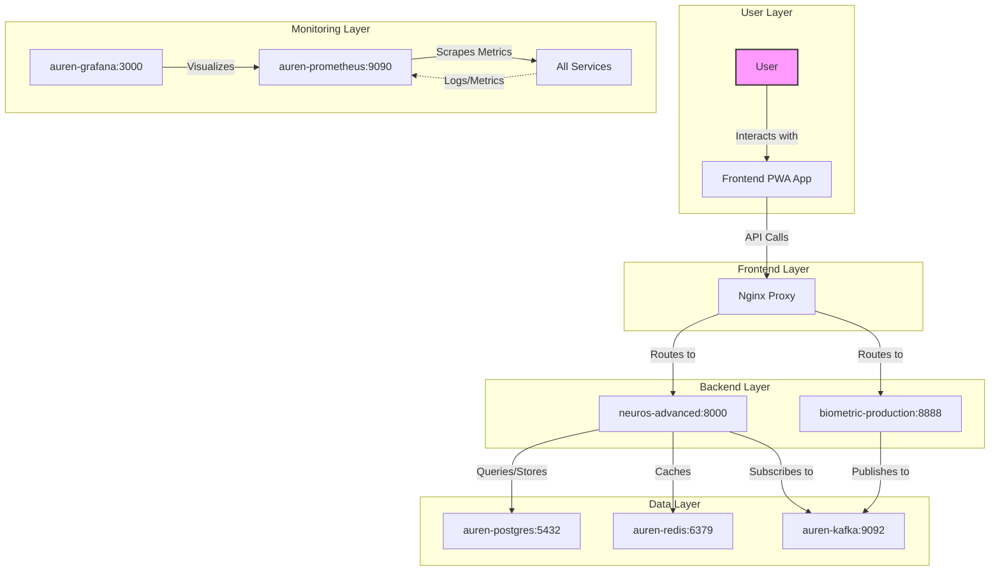

# AUREN DOCKER SERVICES ARCHITECTURE

*Created: January 29, 2025*  
*Author: Senior Engineer*  
*Purpose: Comprehensive mapping of all Docker services, their purposes, connections, and flows for streamlined operations and future maintenance.*

---

## TABLE OF CONTENTS

1. [Overview](#overview)
2. [Current Services Mapping](#current-services-mapping)
3. [Network Configuration](#network-configuration)
4. [Architecture Diagram](#architecture-diagram)
5. [Streamlining Recommendations](#streamlining-recommendations)
6. [PWA Integration Guide](#pwa-integration-guide)
7. [Verification Commands](#verification-commands)
8. [Troubleshooting](#troubleshooting)

---

## OVERVIEW

This document maps AUREN's Docker-based architecture, including all running services, their purposes, interdependencies, and data flows. It addresses potential conflicts (e.g., multiple networks) and provides a plan for streamlining. This ensures clarity for current and future engineers, preventing issues when integrating components like the PWA.

**Key Principles:**
- All services should use `auren-network` for unified connectivity.
- Avoid manual container runs; use Docker Compose for reproducibility.
- Document EVERY change immediately (per SOPs).

---

## CURRENT SERVICES MAPPING

Based on live server data (updated January 29, 2025 - Post-Streamlining):

| Service Name | Image | Ports | Status | Purpose | Dependencies |
|--------------|-------|-------|--------|---------|--------------|
| neuros-advanced | neuros-advanced:final-v2 | 8000 | Up | Advanced NEUROS reasoning backend | Postgres, Redis, OpenAI |
| auren-grafana | grafana/grafana:latest | 3000 | Up | Monitoring dashboard | Prometheus |
| biometric-production | auren_deploy_biometric-bridge:latest | 8888 | Up (healthy) | Biometric data processing (webhooks to Kafka) | Kafka |
| auren-prometheus | prom/prometheus:latest | 9090 | Up | Metrics collection | All services (scraping) |
| auren-postgres | timescale/timescaledb:latest-pg16 | 5432 | Up (healthy) | Database with TimescaleDB | None |
| auren-redis | redis:7-alpine | 6379 | Up (healthy) | Cache and session storage | None |
| auren-kafka | bitnami/kafka:3.5 | 9092 | Up | Event streaming platform | None |

**✅ STREAMLINING COMPLETE:** All services operational and connected to unified network.

---

## NETWORK CONFIGURATION

**STREAMLINED STATE** (redundant networks removed):

| Network Name | Driver | Scope | Attached Services | Status |
|--------------|--------|-------|-------------------|--------|
| auren-network | bridge | local | All 7 production services | ✅ Primary network |
| bridge | bridge | local | System default | System-level |
| host | host | local | System-level | System-level |
| none | null | local | Isolated | System-level |

**Network Topology (auren-network):**
```
auren-grafana: 172.18.0.3/16
auren-kafka: 172.18.0.8/16
auren-postgres: 172.18.0.6/16
auren-prometheus: 172.18.0.2/16
auren-redis: 172.18.0.7/16
biometric-production: 172.18.0.4/16
neuros-advanced: 172.18.0.5/16
```

**✅ CONSOLIDATION COMPLETE:** All services now communicate on unified `auren-network`.

---

## ARCHITECTURE DIAGRAM

Below is a visual representation of service flows (render in Mermaid-compatible viewers like GitHub).



**Diagram Key:**
- **Solid Arrows:** Direct data flows/connections.
- **Dotted Arrows:** Monitoring/secondary flows.
- All services on `auren-network` for internal communication.

---

## STREAMLINING RECOMMENDATIONS

To resolve potential issues:
1. **Network Consolidation:** Run: `docker network connect auren-network <container>` for any service not on it.
2. **Master Docker Compose:** Create/update `auren/docker/docker-compose.yml` to manage ALL services.
3. **Remove Redundancies:** Stop legacy networks/containers if unused (e.g., `docker network rm auren_default`).
4. **PWA Connection:** Update PWA config to call `http://neuros-advanced:8000` (internal) or external URL.

**Proposed Commands to Execute (with Approval):**
```bash
# Example: Connect biometric to main network
sshpass -p '.HvddX+@6dArsKd' ssh root@144.126.215.218 "docker network connect auren-network biometric-production"
```

---

## PWA INTEGRATION GUIDE

1. **Locate PWA Code:** In `auren/dashboard_v2/` or `AUPEX_WEBSITE_DOCUMENTATION/`.
2. **Update API Base:** Change to `http://neuros-advanced:8000` (internal) or `http://144.126.215.218:8000` (external).
3. **Redeploy:** `docker build -t auren-pwa . && docker run -d --name auren-pwa --network auren-network -p 80:80 auren-pwa`.
4. **Test:** Interact via PWA and verify NEUROS responses.

---

## VERIFICATION COMMANDS

```bash
# List containers
docker ps

# Inspect service
docker inspect neuros-advanced

# Test connection
curl http://neuros-advanced:8000/health  # From inside network
```

---

## TROUBLESHOOTING

- **Network Issues:** Check with `docker network inspect auren-network`.
- **Service Conflicts:** Run `docker ps` to spot duplicates; stop with `docker stop <name>`.
- **PWA Not Connecting:** Verify API URL in PWA config; test with `curl` from PWA container.
- **Logs:** `docker logs <container>` for errors.

If issues persist, consult AUREN_DOCS/03_OPERATIONS/DOCKER_NAVIGATION_GUIDE.md.

---

*Document created per SOPs. Ready for PWA integration once approved.* 