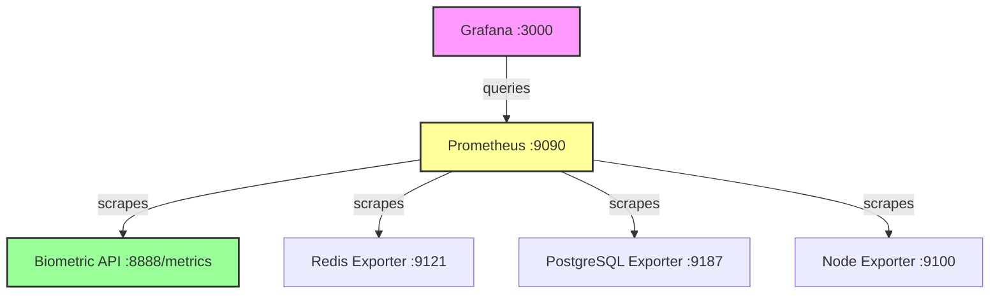

# AUREN MONITORING STABILITY GUIDE

**Created**: January 28, 2025  
**Author**: Senior Engineer  
**Version**: 1.0  
**Purpose**: Prevent monitoring outages and ensure observability resilience

---

## 🚨 Why Monitoring Services Went Down

### Root Causes Analysis (January 28, 2025 Incident)

#### 1. Prometheus Container Exited
**What Happened**: Prometheus received SIGTERM and gracefully shut down  
**Why**: No restart policy was configured  
**Impact**: All metric collection stopped, dashboards showed errors  

**Likely Triggers**:
- System reboot without container restart policies
- Manual `docker stop` during maintenance
- Docker daemon restart
- Out of memory (though logs showed graceful shutdown)

#### 2. Metrics Endpoint Broken
**What Happened**: `/metrics` endpoint returned 500 Internal Server Error  
**Why**: Missing `Response` import in FastAPI application  
**Error**: `NameError: name 'Response' is not defined`  

**Root Cause**:
- Incomplete testing after metrics implementation
- Missing import when adding Prometheus instrumentation
- No automated tests for the metrics endpoint

#### 3. Exporters Not Configured
**What Happened**: Redis, PostgreSQL, and Node exporters showing as "down"  
**Why**: Missing configuration files and environment variables  
**Impact**: Limited system metrics available  

---

## 🛡️ Preventive Measures Implemented

### 1. Container Restart Policies ✅ DONE
All monitoring containers now have restart policies:
```bash
docker update --restart unless-stopped auren-prometheus
docker update --restart unless-stopped auren-grafana
docker update --restart unless-stopped auren-redis-exporter
docker update --restart unless-stopped auren-node-exporter
docker update --restart unless-stopped auren-postgres-exporter
```

**Effect**: Containers will automatically restart after:
- System reboot
- Docker daemon restart
- Container crash
- Manual stop (except with `docker stop`)

### 2. Monitoring Health Checks

Add to docker-compose.yml:
```yaml
services:
  prometheus:
    restart: unless-stopped
    healthcheck:
      test: ["CMD", "wget", "--spider", "-q", "http://localhost:9090/-/ready"]
      interval: 30s
      timeout: 10s
      retries: 3
      start_period: 40s

  grafana:
    restart: unless-stopped
    healthcheck:
      test: ["CMD-SHELL", "curl -f http://localhost:3000/api/health || exit 1"]
      interval: 30s
      timeout: 10s
      retries: 3

  biometric-production:
    restart: unless-stopped
    healthcheck:
      test: ["CMD", "curl", "-f", "http://localhost:8888/health"]
      interval: 30s
      timeout: 10s
      retries: 3
```

### 3. Automated Monitoring of Monitoring

Create a cron job to check monitoring stack:
```bash
# Add to crontab
*/5 * * * * /opt/auren_deploy/scripts/check_monitoring.sh
```

check_monitoring.sh:
```bash
#!/bin/bash
# Check if monitoring services are running
SERVICES="auren-prometheus auren-grafana biometric-production"

for service in $SERVICES; do
    if ! docker ps | grep -q $service; then
        echo "$(date) - $service is down, attempting restart" >> /var/log/auren_monitoring.log
        docker start $service
        
        # Send alert (implement your alerting here)
        # curl -X POST your-alerting-webhook
    fi
done

# Check if metrics are accessible
if ! curl -s http://localhost:8888/metrics > /dev/null; then
    echo "$(date) - Metrics endpoint not responding" >> /var/log/auren_monitoring.log
    docker restart biometric-production
fi

# Check Prometheus targets
DOWN_TARGETS=$(curl -s http://localhost:9090/api/v1/targets | jq '.data.activeTargets[] | select(.health=="down") | .labels.job' | wc -l)
if [ $DOWN_TARGETS -gt 0 ]; then
    echo "$(date) - $DOWN_TARGETS Prometheus targets are down" >> /var/log/auren_monitoring.log
fi
```

### 4. Testing Requirements

Add to CI/CD pipeline:
```python
# test_metrics_endpoint.py
import requests
import pytest

def test_metrics_endpoint():
    """Ensure metrics endpoint returns valid Prometheus format"""
    response = requests.get("http://localhost:8888/metrics")
    assert response.status_code == 200
    assert "# HELP" in response.text
    assert "# TYPE" in response.text
    assert "python_gc_objects_collected_total" in response.text

def test_prometheus_targets():
    """Ensure critical targets are up"""
    response = requests.get("http://localhost:9090/api/v1/targets")
    data = response.json()
    
    critical_jobs = ["biometric-api", "prometheus"]
    for target in data["data"]["activeTargets"]:
        if target["labels"]["job"] in critical_jobs:
            assert target["health"] == "up"
```

---

## 🔍 Monitoring the Monitors

### Daily Checks
1. Verify all containers running: `docker ps | grep -E "prometheus|grafana|exporter"`
2. Check Prometheus targets: http://144.126.215.218:9090/targets
3. Test Grafana datasource: Grafana → Configuration → Data Sources → Test
4. Verify metrics endpoint: `curl http://144.126.215.218:8888/metrics | wc -l`

### Weekly Maintenance
1. Check container logs for errors
2. Review disk usage for Prometheus data
3. Verify backup of Grafana dashboards
4. Test alerting rules

### Monitoring Stack Dependencies


---

## 📊 Current Limitations

### Custom Metrics Not Implemented
The following metrics are defined but not yet integrated:
- `auren_webhook_requests_total`
- `auren_memory_tier_operations_total`
- `auren_neuros_mode_switches_total`
- `auren_biometric_events_processed_total`
- And all other custom AUREN metrics

**Impact**: Dashboards show basic HTTP metrics only  
**Solution**: Implement enhanced_api_metrics.py integration  

### Exporter Configuration Issues
- PostgreSQL exporter: Missing connection string
- Redis exporter: May need authentication
- Node exporter: Network accessibility

**Impact**: Limited system-level metrics  
**Solution**: Configure exporters with proper credentials  

---

## 🚀 Recovery Procedures

### If Prometheus Goes Down
```bash
# 1. Check container status
docker ps -a | grep prometheus

# 2. Check logs for errors
docker logs --tail 50 auren-prometheus

# 3. Restart container
docker start auren-prometheus

# 4. Verify it's scraping
curl http://localhost:9090/api/v1/targets
```

### If Metrics Endpoint Fails
```bash
# 1. Check the error
curl -v http://localhost:8888/metrics

# 2. Check container logs
docker logs --tail 50 biometric-production | grep -i error

# 3. Verify imports are correct
docker exec biometric-production grep -n "from fastapi import" /app/complete_biometric_system.py

# 4. Restart if needed
docker restart biometric-production
```

### If Grafana Can't Connect
```bash
# 1. Test datasource
curl -u admin:auren_grafana_2025 http://localhost:3000/api/datasources/1/health

# 2. Check network connectivity
docker exec auren-grafana wget -O- http://auren-prometheus:9090/api/v1/query?query=up

# 3. Verify both on same network
docker inspect auren-grafana | jq '.[0].NetworkSettings.Networks'
docker inspect auren-prometheus | jq '.[0].NetworkSettings.Networks'
```

---

## 📝 Lessons Learned

1. **Always Set Restart Policies**: Production containers need `restart: unless-stopped`
2. **Test After Implementation**: Metrics endpoints must be tested after adding
3. **Monitor the Monitors**: Meta-monitoring prevents blind spots
4. **Document Dependencies**: Know what depends on what
5. **Automate Recovery**: Scripts should handle common failures

---

*This guide ensures AUREN's observability stack remains resilient and self-healing.* 