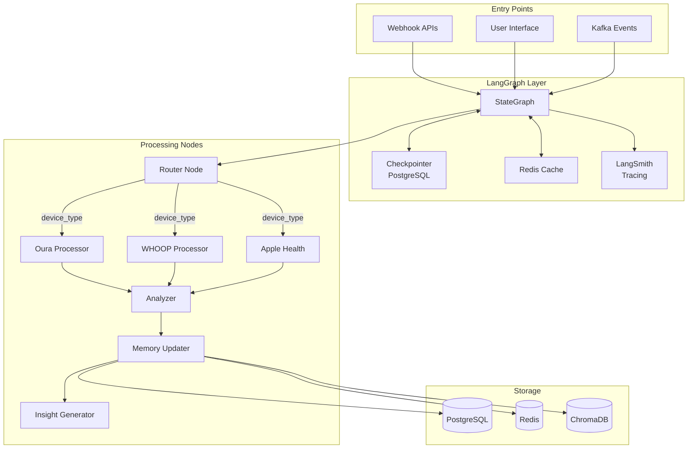

# LANGGRAPH ARCHITECTURE GUIDE
## Post-CrewAI Migration Architecture

*Created: January 29, 2025*  
*Version: 1.0*  
*Purpose: Document LangGraph patterns and architecture after CrewAI removal*

---

## 🏗️ ARCHITECTURE OVERVIEW

AUREN now uses pure LangGraph patterns for all agent orchestration and state management.



---

## 📊 STATE DEFINITIONS

### BiometricEventState
```python
from typing import TypedDict, Annotated, List
from operator import add

class BiometricEventState(TypedDict):
    """State for processing individual biometric events"""
    user_id: str
    event_id: str
    device_type: str
    timestamp: datetime
    raw_data: dict
    processed_data: dict
    analysis_results: Annotated[dict, lambda a, b: {**a, **b}]  # Merge dicts
    insights: Annotated[List[str], add]  # Merge lists
    confidence_scores: Annotated[List[float], add]
    mode_recommendation: Optional[str]
    memory_updates: Annotated[List[dict], add]
```

### Key Patterns:
1. **Reducers**: Use `Annotated` types with merge functions for parallel processing
2. **Type Safety**: All states use TypedDict for compile-time checking
3. **Immutability**: States are passed by value, not reference

---

## 🔄 GRAPH CONSTRUCTION

### Basic Graph Building
```python
from langgraph.graph import StateGraph, END

def build_biometric_graph() -> StateGraph:
    """Build the biometric processing graph"""
    builder = StateGraph(BiometricEventState)
    
    # Add nodes
    builder.add_node("router", route_biometric_event)
    builder.add_node("oura", process_oura_event)
    builder.add_node("whoop", process_whoop_event)
    builder.add_node("apple_health", process_apple_health_event)
    builder.add_node("analyzer", analyze_biometric_patterns)
    builder.add_node("memory_updater", update_memory_tiers)
    builder.add_node("insight_generator", generate_insights)
    
    # Add edges
    builder.set_entry_point("router")
    
    # Conditional routing based on device type
    builder.add_conditional_edges(
        "router",
        lambda state: state.get("device_type", "manual"),
        {
            "oura": "oura",
            "whoop": "whoop", 
            "apple_health": "apple_health",
            "manual": "analyzer"
        }
    )
    
    # Linear flow after device processing
    builder.add_edge("oura", "analyzer")
    builder.add_edge("whoop", "analyzer")
    builder.add_edge("apple_health", "analyzer")
    builder.add_edge("analyzer", "memory_updater")
    builder.add_edge("memory_updater", "insight_generator")
    builder.add_edge("insight_generator", END)
    
    return builder
```

---

## 🔒 CHECKPOINTING & PERSISTENCE

### PostgreSQL Checkpointing
```python
from langgraph.checkpoint.postgres import PostgresSaver
from auren.config.langgraph_config import get_langgraph_runtime

# Get runtime with all configurations
runtime = get_langgraph_runtime()

# Compile with checkpointing
graph = builder.compile(
    checkpointer=runtime.checkpointer,
    interrupt_before=[],  # Pause before specific nodes
    interrupt_after=[]    # Pause after specific nodes
)

# Run with checkpoint
config = runtime.get_runnable_config(
    thread_id="user_123_session_456",
    user_id="user_123",
    tags=["biometric", "oura"]
)

result = await graph.ainvoke(initial_state, config)
```

### Checkpoint Features:
- **Thread-based**: Each conversation/session has unique thread_id
- **Resumable**: Can restart from any checkpoint
- **Time-travel**: Can rewind to previous states
- **Persistent**: Survives server restarts

---

## 🔍 LANGSMITH TRACING

### Automatic Tracing
```python
# Tracing is automatic when LANGSMITH_API_KEY is set
os.environ["LANGSMITH_API_KEY"] = "your-key"
os.environ["LANGSMITH_PROJECT"] = "auren-production"

# All graph runs will be traced
result = await graph.ainvoke(state, config)

# View in LangSmith UI:
# - Execution time per node
# - Token usage
# - Error traces
# - State transitions
```

### Custom Metadata
```python
config = runtime.get_runnable_config(
    thread_id=thread_id,
    metadata={
        "device": "oura",
        "user_tier": "premium",
        "analysis_type": "sleep"
    },
    tags=["production", "biometric", "v2"]
)
```

---

## 🚀 DEVELOPER GUIDE

### Adding a New Node

1. **Define the node function**:
```python
async def process_new_device(state: BiometricEventState) -> dict:
    """Process data from new device"""
    raw_data = state["raw_data"]
    
    # Process data
    processed = transform_data(raw_data)
    
    # Return state updates
    return {
        "processed_data": processed,
        "insights": ["New insight from device"],
        "confidence_scores": [0.95]
    }
```

2. **Add to graph**:
```python
builder.add_node("new_device", process_new_device)
builder.add_edge("new_device", "analyzer")
```

3. **Update router**:
```python
builder.add_conditional_edges(
    "router",
    route_function,
    {
        "new_device": "new_device",
        # ... other routes
    }
)
```

### Best Practices

1. **State Updates**:
   - Only return fields you want to update
   - Use reducers for fields that merge
   - Never mutate input state

2. **Error Handling**:
   - Wrap node logic in try/except
   - Return error state instead of raising
   - Use state["errors"] field for tracking

3. **Performance**:
   - Keep nodes focused (single responsibility)
   - Use async for I/O operations
   - Cache expensive computations

4. **Testing**:
   - Test nodes in isolation
   - Mock external dependencies
   - Use test fixtures for states

---

## 🔧 COMMON PATTERNS

### Parallel Processing
```python
# Send to multiple nodes simultaneously
from langgraph.constants import Send

def fanout_to_specialists(state):
    """Send to multiple specialist nodes"""
    return [
        Send("specialist_1", state),
        Send("specialist_2", state),
        Send("specialist_3", state)
    ]
```

### Conditional Loops
```python
def should_continue(state):
    """Decide whether to continue processing"""
    if state["confidence_scores"][-1] < 0.7:
        return "refine"
    return "complete"

builder.add_conditional_edges(
    "analyzer",
    should_continue,
    {
        "refine": "analyzer",  # Loop back
        "complete": "memory_updater"
    }
)
```

### State Validation
```python
def validate_state(state: BiometricEventState) -> BiometricEventState:
    """Validate and clean state"""
    required_fields = ["user_id", "event_id", "device_type"]
    
    for field in required_fields:
        if field not in state:
            raise ValueError(f"Missing required field: {field}")
    
    return state
```

---

## 📋 MIGRATION CHECKLIST

From CrewAI to LangGraph:

- [x] Replace Agent classes with node functions
- [x] Convert Crew to StateGraph
- [x] Replace Task with graph edges
- [x] Update imports from crewai to langgraph
- [x] Add TypedDict state definitions
- [x] Implement reducers for parallel ops
- [x] Add checkpointing
- [x] Enable tracing
- [x] Update tests

---

## 🚨 TROUBLESHOOTING

### Common Issues

1. **"No path to END"**
   - Ensure all conditional edges have default path
   - Add explicit edge to END from final nodes

2. **State not updating**
   - Check reducer functions
   - Verify node returns dict with updates
   - Ensure field names match TypedDict

3. **Checkpoint not saving**
   - Verify PostgreSQL connection
   - Check thread_id is provided
   - Ensure checkpointer is passed to compile()

4. **Tracing not showing**
   - Verify LANGSMITH_API_KEY is set
   - Check project name matches
   - Ensure callbacks are not overridden

---

## 📚 REFERENCES

- [LangGraph Documentation](https://langchain-ai.github.io/langgraph/)
- [LangSmith Documentation](https://docs.smith.langchain.com/)
- [TypedDict Reference](https://docs.python.org/3/library/typing.html#typing.TypedDict)
- [PostgreSQL Checkpointing](https://langchain-ai.github.io/langgraph/how-tos/persistence/)

---

*This guide documents the complete LangGraph architecture post-CrewAI migration.* 