# AUREN HUMAN PERFORMANCE OS ARCHITECTURE v1.0
*The Complete Nine-Agent Event-Driven Human Optimization Platform*

**Last Updated**: July 31, 2025  
**Status**: 🎯 **STRATEGIC MASTER ARCHITECTURE** - Complete System Design  
**Tier**: **HIGHEST PRIORITY** - Foundation for all AUREN development  
**Scope**: Nine tightly-coupled specialist agents operating as unified human-performance OS

---

## 🚀 **EXECUTIVE SYNTHESIS: THE HUMAN PERFORMANCE OPERATING SYSTEM**

**AUREN** represents the world's first **event-driven human performance operating system** - nine specialist AI agents working as a unified intelligence to optimize every aspect of human performance in real-time.

**Core Innovation**: Unlike traditional health apps with data silos, AUREN operates as a **single, coherent OS** where specialists communicate through shared event streams, collaborate on complex interventions, and build compound knowledge over time.

**Competitive Moat**: Event-driven architecture with **sub-2 second response times** and **cross-domain reasoning** that competitors with batch processing and siloed apps cannot replicate.

---

## 🎭 **THE COMPLETE SPECIALIST ROSTER: 9-AGENT ARCHITECTURE**

### **Agent Hierarchy & Orchestration**

```mermaid
graph TB
    AUREN[🎯 AUREN<br/>Chief-of-Staff<br/>Orchestrator]
    
    AUREN --> NEUROS[🧠 NEUROS<br/>Brain & Nerves]
    AUREN --> NUTROS[🥗 NUTROS<br/>Nutrition]
    AUREN --> KINETOS[🏃 KINETOS<br/>Movement]
    AUREN --> HYPERTROS[💪 HYPERTROS<br/>Strength]
    AUREN --> CARDIOS[❤️ CARDIOS<br/>Cardiovascular]
    AUREN --> ENDOS[🧪 ENDOS<br/>Endocrine]
    AUREN --> OPTICOS[👁️ OPTICOS<br/>Visual]
    AUREN --> SOMNOS[😴 SOMNOS<br/>Sleep]
    
    NEUROS <--> SOMNOS
    KINETOS <--> HYPERTROS
    CARDIOS <--> ENDOS
    OPTICOS <--> NUTROS
    
    style AUREN fill:#gold,stroke:#333,stroke-width:4px
```



### **Complete Agent Specifications**

| Agent | Name Root | Core Mission | Key Output KPIs | Current Status |
|-------|-----------|--------------|-----------------|----------------|
| **🎯 AUREN** | Aurum → "gold standard" | Chief-of-Staff UI, schedule & task routing | SLA response time, task completion rate | ✅ **UI READY** |
| **🧠 NEUROS** | neur- "nerve" | CNS health, HRV analysis, mood & focus | HRV trend, fatigue flags | ✅ **OPERATIONAL** |
| **🥗 NUTROS** | nutri- "nourish" | Macros, supplements, microbiome | Macro adherence, micronutrient gaps | 🔧 **Month 3** |
| **🏃 KINETOS** | kineto- "movement" | Mobility drills, injury prevention | ROM delta, injury-risk score | 🔧 **Month 4** |
| **💪 HYPERTROS** | hyper- "excess" + troph- "nourishment" | Strength & hypertrophy programming | Weekly tonnage, lean-mass delta | 🔧 **Month 5** |
| **❤️ CARDIOS** | cardio- "heart" | Zone-based conditioning, VO₂-max ramps | VO₂-max, resting HR, lipid panel flags | 🔧 **Month 6** |
| **🧪 ENDOS** | endo- "within" (endocrine) | Peptide cycles, hormonal safety, legality radar | Protocol-safety index, dose schedule | 🔧 **Month 9** |
| **👁️ OPTICOS** | opt- "eye/vision" | MIRAGE facial/body symmetry & aesthetics | Inflammation score, symmetry delta | 🔧 **Month 8** |
| **😴 SOMNOS** | somn- "sleep" | Sleep architecture & chronotype tuning | Deep-sleep %, REM balance, circadian drift | 🔧 **Month 7** |

---

## ⚡ **EVENT-DRIVEN ARCHITECTURE: THE PERFORMANCE OS BACKBONE**

### **Real-Time Event Processing Stack**


### **Event Bus Architecture**

**Kafka Topics Structure**:
```yaml
Input Streams:
  - biometric-raw: HRV, sleep, activity data
  - journal-entries: User logs, goals, feedback
  - lab-results: Blood panels, DEXA scans
  - mirage-images: Facial/body composition photos

Processing Streams:
  - neuros-analysis: CNS and HRV insights
  - nutros-recommendations: Nutrition protocols
  - kinetos-assessments: Movement analysis
  - hypertros-programs: Strength protocols
  - cardios-zones: Cardiovascular training
  - endos-cycles: Hormone/peptide protocols
  - opticos-analysis: Visual biometric tracking
  - somnos-architecture: Sleep optimization

Output Streams:
  - composite-interventions: Multi-agent recommendations
  - safety-alerts: Critical health flags
  - progress-summaries: KPI updates
  - master-journal: Unified user timeline
```

### **Flink CEP Pattern Detection**

**Composite Alert Examples**:
```sql
-- Sleep degradation + HRV drop pattern
SELECT user_id, timestamp
FROM biometric_stream
MATCH_RECOGNIZE (
  PARTITION BY user_id
  ORDER BY timestamp
  MEASURES A.timestamp as start_time
  PATTERN (A B+ C)
  DEFINE
    A as A.sleep_quality < 80,
    B as B.hrv_trend < -15,
    C as C.duration > 48_hours
)

-- Recovery intervention trigger
-- SOMNOS + NEUROS collaboration required
```

---

## 🤝 **CROSS-AGENT COLLABORATION: UNIFIED INTELLIGENCE**

### **Dynamic Hand-off Workflows**

**Scenario 1: Posterior Chain Tightness**


**Scenario 2: Peptide Cycle Management**


**Scenario 3: Hypertrophy Optimization**


### **Collaboration Rules & Priorities**

**Shared KPI Dictionary**:
```python
class UniversalMetric:
    def __init__(self):
        self.timestamp: datetime
        self.metric_name: str
        self.value: float
        self.confidence: float  # 0.0-1.0
        self.source_agent: str
        self.context: dict
```

**Agent Priority Matrix**:
```yaml
Safety Overrides:
  - NEUROS: CNS safety flags (highest priority)
  - ENDOS: Hormone/peptide safety (highest priority)
  - KINETOS: Injury risk prevention (high priority)

Domain Authority:
  - NUTROS: Nutrition recommendations (cannot be overridden by non-nutrition agents)
  - CARDIOS: Cardiovascular zone prescriptions (domain authority)
  - SOMNOS: Sleep architecture decisions (domain authority)

Collaboration Triggers:
  - OPTICOS facial inflammation → NUTROS anti-inflammatory adjustment
  - SOMNOS sleep debt >15h → CARDIOS volume reduction
  - NEUROS HRV drop → HYPERTROS deload recommendation
```

### **Feedback Loop Architecture**

**Real-Time Adjustments**:
```python
class CrossAgentFeedback:
    async def process_intervention_feedback(self, intervention_id: str, outcome: dict):
        # Track intervention effectiveness
        effectiveness_score = await self.calculate_effectiveness(outcome)
        
        # Update agent confidence scores
        await self.update_agent_confidence(intervention_id, effectiveness_score)
        
        # Trigger protocol adjustments if needed
        if effectiveness_score < 0.7:
            await self.request_protocol_revision(intervention_id)
            
        # Share learnings across all agents
        await self.broadcast_learning(intervention_id, outcome)
```

---

## 🧠 **UNIFIED MEMORY ARCHITECTURE: COMPOUND INTELLIGENCE**

### **Three-Tier Memory System**

**Hot Memory (Redis) - Immediate Context**:
```yaml
Duration: 48 hours
Latency: <10ms
Contents:
  - Active conversation state
  - Current intervention protocols
  - Real-time biometric streams
  - Pending agent collaborations
```

**Warm Memory (pgvector) - Longitudinal Patterns**:
```yaml
Duration: Permanent
Latency: <50ms
Contents:
  - User preference embeddings
  - Intervention effectiveness history
  - Cross-agent collaboration patterns
  - Seasonal performance trends
```

**Cold Memory (S3) - Deep Historical Archive**:
```yaml
Duration: Permanent with compression
Latency: <200ms
Contents:
  - Complete interaction history
  - Raw biometric data archives
  - Visual progress timelines
  - Long-term outcome correlations
```

### **Memory Sharing Protocol**

**Embedding Standardization**:
```python
class UniversalEmbedding:
    def __init__(self):
        self.vector: List[float]  # 1536-dimensional
        self.metadata: dict
        self.access_patterns: List[str]  # Which agents can access
        self.temporal_weight: float  # Recency importance
        self.cross_domain_links: List[str]  # Related embeddings
```

**Cross-Agent Memory Access**:
```python
class MemoryAccessLayer:
    async def get_relevant_context(self, agent_id: str, query: str) -> List[Memory]:
        # Agent-specific context retrieval
        agent_memories = await self.query_agent_embeddings(agent_id, query)
        
        # Cross-domain relevant memories
        cross_domain = await self.query_related_domains(agent_id, query)
        
        # Temporal relevance weighting
        return await self.weight_by_recency(agent_memories + cross_domain)
```

---

## 🎯 **DYNAMIC ORCHESTRATION: AUREN AS CHIEF-OF-STAFF**

### **Intelligent Request Routing**

**Multi-Domain Query Analysis**:
```python
class AURENOrchestrator:
    async def process_user_request(self, request: str) -> CompoundResponse:
        # 1. Classify request complexity and domains
        classification = await self.classify_request(request)
        
        # 2. Route to primary specialist(s)
        primary_responses = await self.route_to_specialists(classification)
        
        # 3. Trigger cross-agent collaboration if needed
        if classification.complexity > 0.7:
            peer_reviews = await self.orchestrate_collaboration(primary_responses)
        
        # 4. Synthesize unified response
        unified_response = await self.synthesize_response(
            primary_responses, peer_reviews, request
        )
        
        # 5. Update Master Journal and trigger VISOR/MIRAGE
        await self.update_master_journal(unified_response)
        
        return unified_response
```

**Real-Time Task Management**:
```yaml
AUREN Responsibilities:
  - Request classification and routing
  - Cross-agent collaboration orchestration
  - Response synthesis and coherence
  - Master Journal maintenance
  - VISOR/MIRAGE trigger management
  - User preference learning
  - SLA monitoring and optimization
```

### **OmniSweep Trigger System**

**Comprehensive Analysis Triggers**:
```python
class OmniSweepTrigger:
    async def evaluate_trigger_conditions(self, user_id: str):
        recent_logs = await self.get_recent_logs(user_id, hours=24)
        
        if len(recent_logs) >= 5:
            # Trigger comprehensive multi-agent analysis
            await self.orchestrate_omnisweep(user_id, recent_logs)
            
        elif self.detect_anomaly_pattern(recent_logs):
            # Trigger targeted specialist intervention
            await self.orchestrate_targeted_intervention(user_id, recent_logs)
```

---

## 📊 **REAL-TIME PERFORMANCE MONITORING**

### **System-Wide KPIs**

**Response Time SLAs**:
- **Single Agent Response**: <2s (competitive moat)
- **Cross-Agent Collaboration**: <5s 
- **OmniSweep Analysis**: <15s
- **Memory Retrieval**: Hot <10ms, Warm <50ms, Cold <200ms

**Intelligence Quality Metrics**:
- **Cross-Agent Enhancement**: >30% of recommendations improved by collaboration
- **Intervention Effectiveness**: >85% user satisfaction with compound protocols
- **Pattern Detection**: <100ms for composite event identification
- **Longitudinal Learning**: Measurable improvement in recommendation quality over time

**System Health Monitoring**:
```python
class PerformanceOSMonitoring:
    def __init__(self):
        self.metrics = {
            'agent_response_times': defaultdict(list),
            'collaboration_success_rates': defaultdict(float),
            'memory_access_patterns': defaultdict(list),
            'user_satisfaction_scores': defaultdict(list),
            'cross_domain_learning_rate': float
        }
        
    async def monitor_system_health(self):
        # Real-time performance tracking
        # Cross-agent collaboration effectiveness
        # Memory system performance
        # User outcome correlation
        pass
```

---

## 🚀 **STRATEGIC ADVANTAGES: WHY THIS ARCHITECTURE WINS**

### **Technical Moats**

**1. Event-Driven Real-Time Processing**
- **Advantage**: Sub-2s responses vs competitors' 10-30s batch processing
- **Implementation**: Kafka + Flink CEP for composite pattern detection
- **Competitive Gap**: Impossible to replicate without full architecture rebuild

**2. Cross-Domain Reasoning**
- **Advantage**: Specialists collaborate on complex interventions
- **Implementation**: Shared memory layer + collaboration protocols
- **Competitive Gap**: Siloed apps cannot achieve compound intelligence

**3. Compound Memory Building**
- **Advantage**: Years of longitudinal learning vs 30-day memory limits
- **Implementation**: Three-tier memory with cross-agent embeddings
- **Competitive Gap**: Requires unified architecture from ground up

**4. Unified Human Performance OS**
- **Advantage**: Nine specialists operating as single coherent system
- **Implementation**: AUREN orchestration + shared KPI dictionary
- **Competitive Gap**: Most platforms focus on single domains

### **Market Positioning**

**Unique Value Propositions**:
- **Complete Human Optimization**: Only platform covering all 9 performance domains
- **Real-Time Intelligence**: Event-driven responses enable proactive interventions
- **Compound Learning**: Cross-agent collaboration improves over time
- **Unified Experience**: Single interface for complete human performance management

**Regulatory Advantages**:
- **FDA General Wellness**: All agents maintain performance optimization positioning
- **Safety-First Architecture**: NEUROS and ENDOS override protocols prioritize user safety
- **Compliance by Design**: Built-in safety filters and medical disclaimer automation

---

## 🛠️ **IMPLEMENTATION ROADMAP: BUILDING THE PERFORMANCE OS**

### **Phase 1: Foundation (Months 1-3)**
```yaml
Month 1-2: Core Infrastructure
  - Complete 3-tier memory system (pgvector implementation)
  - Protocol execution engine (Dagster integration)
  - Flink CEP basic patterns

Month 3: First Specialist Addition
  - NUTROS implementation with NEUROS collaboration
  - Cross-agent communication protocols
  - Shared memory access patterns
```

### **Phase 2: Specialist Expansion (Months 4-6)**
```yaml
Month 4: Movement & Strength
  - KINETOS: Movement analysis and injury prevention
  - HYPERTROS: Strength programming and periodization
  - KINETOS ↔ HYPERTROS collaboration protocols

Month 5-6: Cardiovascular & Sleep
  - CARDIOS: Zone training and metabolic optimization
  - SOMNOS: Sleep architecture and recovery protocols
  - Multi-agent intervention protocols
```

### **Phase 3: Advanced Capabilities (Months 7-9)**
```yaml
Month 7-8: Visual & Aesthetic Intelligence
  - OPTICOS: MIRAGE integration and visual biometrics
  - Cross-domain feedback loops (visual → nutrition)
  
Month 9: Endocrine Optimization
  - ENDOS: Peptide/hormone cycle management
  - Advanced safety protocols and regulatory compliance
  - Complete 9-agent collaboration framework
```

### **Phase 4: Performance OS Optimization (Months 10-12)**
```yaml
Month 10-11: System Optimization
  - Advanced Flink CEP patterns
  - Cross-agent learning optimization
  - Performance tuning and scaling

Month 12: Launch Readiness
  - Complete system testing
  - User outcome validation
  - Production scaling preparation
```

---

## 🏆 **SUCCESS METRICS: MEASURING THE PERFORMANCE OS**

### **Technical Excellence**
- **Response Times**: Maintain <2s single agent, <5s multi-agent SLAs
- **System Availability**: 99.9% uptime across all nine agents
- **Memory Performance**: <50ms warm memory retrieval across all domains
- **Collaboration Quality**: >90% of multi-agent interventions rated as enhanced

### **User Outcomes**
- **Cross-Domain Improvement**: Measurable gains in all 9 performance areas
- **Intervention Effectiveness**: >85% user satisfaction with compound protocols
- **Longitudinal Learning**: Demonstrable recommendation improvement over time
- **User Retention**: >90% retention through compound value delivery

### **Market Leadership**
- **Complete Coverage**: Only platform optimizing all human performance domains
- **Technology Leadership**: Event-driven architecture setting industry standard
- **Competitive Moat**: Technical capabilities competitors cannot replicate
- **Regulatory Compliance**: Zero safety incidents while maintaining performance focus

---

**This architecture represents the complete realization of AUREN's vision: the world's first Human Performance Operating System, where nine specialist AI agents work as unified intelligence to optimize every aspect of human performance in real-time.**

*"Not just an app, not just agents - but a complete Human Performance Operating System that learns, adapts, and optimizes across every domain of human potential."*

**END OF HUMAN PERFORMANCE OS ARCHITECTURE v1.0** 