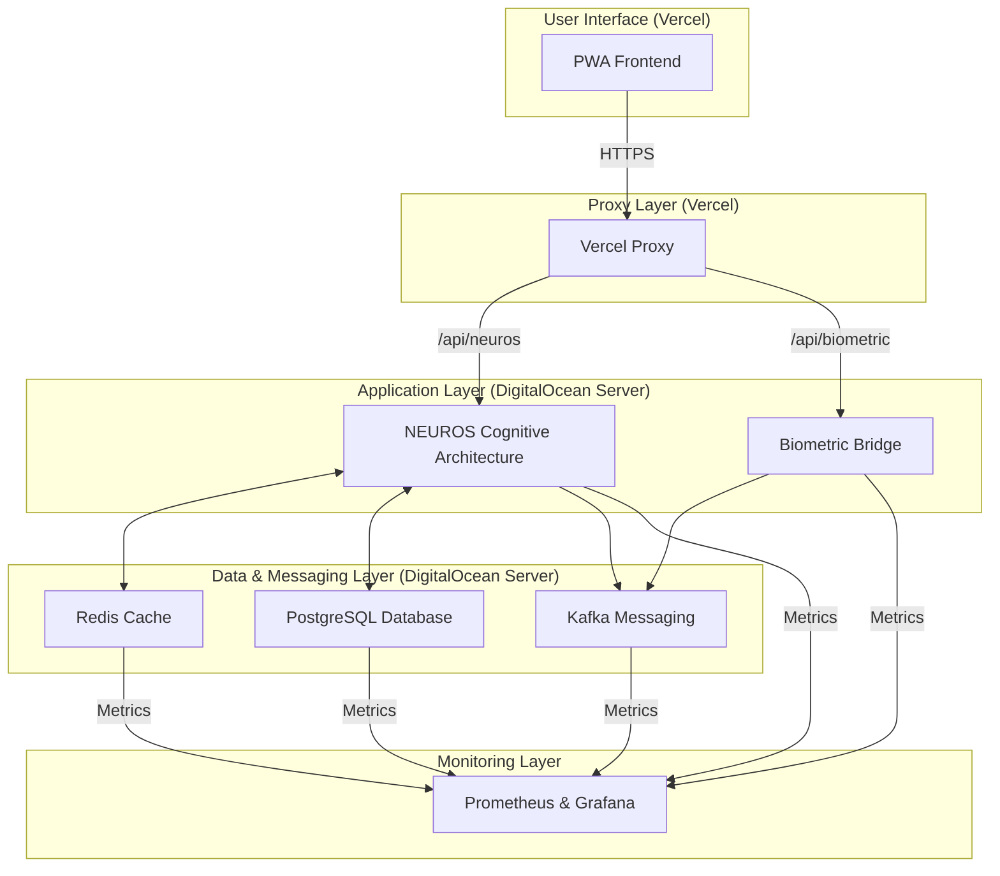

# AUREN AI AGENT - MASTER CONFIGURATION & RESEARCH GUIDE

**Document Purpose**: To provide the co-founders with a single, comprehensive overview of the entire AUREN AI agent architecture, from frontend to infrastructure. This document will serve as a foundational resource for strategic research into implementing the remaining capabilities (Phases 5-13) of the NEUROS cognitive architecture.

**Current Status**: The core system is **fully operational** and **exceeding performance targets** for its implemented features (approx. 50-60% of the full YAML specification).

---

## 1. The Big Picture: System Architecture Overview

This diagram illustrates the complete, end-to-end data flow of the AUREN system.

### Key Takeaways:
- **Decoupled Frontend/Backend**: The PWA is completely separate from the backend services, communicating only through a secure proxy.
- **Centralized AI Logic**: All intelligence resides within the `NEUROS Cognitive Architecture` container.
- **Scalable Infrastructure**: The use of Kafka, Redis, and a dedicated database allows for significant horizontal scaling.

---

## 2. Deep Dive: Component Configuration

Below is a breakdown of each major component and a direct link to its primary configuration file.

### Frontend
- **Description**: A Vite + React Progressive Web App (PWA) hosted on Vercel. It provides the user interface for interacting with NEUROS.
- **Key Config File**: `auren-pwa/vercel.json`
- **What it Defines**: The crucial proxy rules that securely connect the PWA to the backend services without exposing direct IP addresses.

### Backend - NEUROS Cognitive Architecture
- **Description**: The "brain" of the system. A FastAPI application running a LangGraph-based state machine that handles all user interactions, memory, and cognitive processing.
- **Key Config Files**:
    - `auren/docker/docker-compose.yml` (Defines the `neuros-advanced` service)
    - `auren/agents/neuros/neuros_advanced_reasoning_simple.py` (The Python code for the cognitive architecture)
- **What it Defines**: The LangGraph nodes, state transitions, Redis connection for caching, and the core logic for the ~60% of implemented YAML features.

### Infrastructure
- **Description**: A suite of containerized services running on a DigitalOcean server, all orchestrated via Docker Compose.
- **Key Config File**: `auren/docker/docker-compose.yml`
- **What it Defines**:
    - `auren-postgres`: The primary time-series database for long-term data.
    - `auren-redis`: The "hot" cache for fast-retrieval memory and session data.
    - `auren-kafka`: The event streaming bus for processing real-time biometric data.
    - `auren-prometheus` & `auren-grafana`: The monitoring and observability stack.

---

## 3. The Research Gap: Implementing Phases 5-13

The current implementation successfully covers the foundational phases (1-4) and stubs for some advanced features (10, 11). To achieve the full vision of the NEUROS YAML specification, the following concepts need to be researched and developed.

### The Real Gap: From "What" to "How"

The YAML specification tells us *what* to build (e.g., "meta-reasoning"). The gap is in the *how* – the specific algorithms, code, and integration patterns required to bring these concepts to life within our existing LangGraph architecture.

| YAML Phase | What's Needed for Research & Implementation |
| :--- | :--- |
| **Phase 5: Meta-Reasoning** | - **Algorithms**: Research algorithms for self-reflection in LLMs. How does a graph network analyze its own paths? Look into "Chain-of-Thought" prompting applied to graph traversal.   - **Code**: A new LangGraph node (`meta_reasoning_node`) that takes the graph's trace as input.   - **Integration**: How to conditionally route to this node? Perhaps after complex queries or when a user asks, "Why did you think that?" |
| **Phase 6: System Harmony** | - **Algorithms**: Research conflict resolution models. Could be a simple rule-based system or a more complex "utility function" that weighs conflicting user goals.   - **Code**: A node that can access and compare different state variables (e.g., `user_goals`, `biometric_stress_level`).   - **Integration**: This node would likely be a conditional check at the end of a cycle to ensure the proposed action is harmonious. |
| **Phase 7: Adaptive Memory** | - **Database Schema**: Design the schemas for "warm" (Postgres) and "cold" (S3/file storage) memory tiers. What metadata is needed for retrieval?   - **Algorithms**: Research summarization and embedding strategies for moving data between tiers. How do you summarize a week of conversation into a single vector?   - **Code**: Implement `MemoryManager` class with methods like `consolidate_hot_memory()` and `retrieve_from_warm()`. |
| **Phase 8: Behavior Modeling** | - **Algorithms**: Explore user behavior modeling techniques. This could involve time-series analysis of user interaction patterns (e.g., when do they ask for help?).   - **Code**: A background process or a periodic node that analyzes user interaction history stored in the database.   - **Integration**: The output of this model would update a user's profile in the `NEUROSState`, influencing future interactions. |
| **Phase 9: Recalibration** | - **Algorithms**: Research methods for detecting "model drift" or "protocol fatigue." This is about identifying when the AI's suggestions are becoming less effective.   - **Code**: A node that compares recent outcomes (`harmony_score`, `user_feedback`) against historical averages.   - **Integration**: If drift is detected, the graph could route to a "re-planning" or "suggestion exploration" branch. |
| **Phase 12: Multi-Agent** | - **Architecture**: How would a second agent (e.g., a "nutritionist specialist") be represented? A separate LangGraph? A callable tool?   - **Code**: Define clear input/output schemas for inter-agent communication.   - **Integration**: The main NEUROS graph would have a node that decides when to "delegate" a task to a specialist agent. |
| **Phase 13: Pre-Symptom** | - **Algorithms**: This is the most research-intensive. It requires combining biometric data analysis (e.g., anomaly detection in HRV) with interaction patterns.   - **Code**: A highly specialized node or microservice that runs predictive models on time-series data from Postgres.   - **Integration**: This would be a high-priority interrupt in the LangGraph, capable of proactively starting a conversation with the user. |

---

## 4. Master Documentation List

For a complete, top-to-bottom understanding of the system as it stands today, review these documents in order:

1.  **[This Document] `AUREN_SYSTEM_CONFIGURATION_OVERVIEW.md`**: Your starting point and guide.
2.  **`AUREN_DOCS/01_ARCHITECTURE/AUREN_BACKEND_INFRASTRUCTURE_CERTIFICATION.md`**: Certifies the production-readiness and performance of the backend components.
3.  **`FULL_PIPELINE_CONFIG_WITH_PWA.md`**: Provides the locked, end-to-end technical configuration of the entire deployed system.
4.  **`auren/docker/docker-compose.yml`**: Defines all the running services and their relationships.
5.  **`auren-pwa/vercel.json`**: Shows how the frontend is securely connected to the backend.
6.  **`auren/agents/neuros/neuros_advanced_reasoning_simple.py`**: The actual Python code that represents the current 50-60% implementation of the NEUROS brain.

This package provides a complete, accurate, and transparent view of the AUREN system, empowering you for the next phase of strategic research and development. 