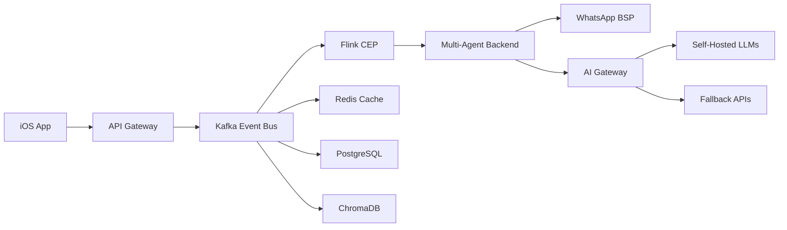

# AUREN System - Master Blueprint & Source of Truth (Version 20)
*Last Updated: July 20, 2025*
*Comprehensive Technical & Strategic Blueprint - Infrastructure to Market Leadership*

## 🚀 Strategic Positioning: Your Elite Performance Team

**AUREN** unlocks human performance potential through the world's first team of AI specialists that understand your body at the neurological level. We're not a health app - we're engineering peak human performance through PhD-level expertise available 24/7.

**Core Innovation**: Multi-agent AI collaboration that transforms biometric insights and conversational patterns into dynamic, personalized performance optimization within seconds. Think of it as having the support team of an Olympic athlete or Tier 1 military operator in your pocket.

**Strategic Breakthroughs**: 
1. FDA's "General Wellness" safe harbor - we optimize performance, not treat conditions
2. Self-hosted LLM infrastructure creates 82-88% cost advantage at scale
3. Event-driven architecture enables CNS-level optimization in real-time
4. Infrastructure complexity is our moat - competitors can't replicate without complete rebuild

**Market Validation**: AI startups command 83% premium valuations and capture 62% of digital health funding ($3.95B in H1 2025). The AI wellness coaching market grows from $9.8B (2024) to $46.1B (2034) at 16.8% CAGR. We're entering at the perfect moment.

## 🎯 Executive Summary

AUREN creates a team of specialized AI agents working together to unlock human performance potential. Unlike traditional health apps that forget after 30 days, AUREN builds compound knowledge over months and years, discovering personalized biological laws unique to each user.

**Market Position**: We occupy the unique space between:
- **Wearable Platforms** (Whoop, Oura): Excellent data, limited guidance
- **Fitness Apps** (Fitbod, MyFitnessPal): Static plans, no real-time adaptation
- **AI Integration**: Simple automation without true multi-agent collaboration

**Our Unique Value**: We're not competing with wearables - we make them exponentially more valuable. But more importantly, AUREN provides profound performance insights through conversation alone. The more users interact, the deeper the system's understanding becomes. Wearables become force multipliers, not requirements.

**Technical Foundation**: Event-driven architecture (Kafka/Flink/ChromaDB) processing millions of biometric events in real-time, enabling sub-2 second responses and complex pattern recognition that batch-processing competitors cannot match. This infrastructure complexity is our moat - it enables real-time CNS optimization that would require a team of PhD specialists.

## 🔄 CHECKPOINT STATUS - July 20, 2025

**Current Phase**: Infrastructure Development → Pre-Alpha Testing

### What's Complete ✅
- Kafka infrastructure operational (localhost:9092)
- Repository pattern implemented (Database, Agent, Task, Crew repositories)
- BaseSpecialist framework ready
- Schema Registry with Pydantic bridge
- Health monitoring for all services
- Strategic positioning locked (FDA safe harbor)
- Beta monetization framework defined
- Go-to-market strategy validated

### What's In Progress 🔄
- Three-tier memory system deployment
- Token tracking decorators
- AI Gateway implementation
- Flink CEP rules
- WhatsApp BSP full integration

### What's Needed 🚧
- Specialist agent implementations
- Memory extraction service
- Complex event processing patterns
- Cost monitoring dashboards
- Integration testing suite

## 🏗️ Technical Architecture: The Competitive Moat

### Core Architecture Pattern: Event-Driven Privacy-First Pipeline



**Why This Architecture**:
- **Real-time Processing**: Sub-2s response vs 10-30s batch delays
- **Complex Patterns**: "HRV + Sleep + Load = Recommendation" 
- **Infinite Scale**: Millions of events/second without rebuilding
- **Stream Learning**: Real-time model updates vs batch training

### Three-Tier Memory Architecture with ETL Pipeline

```
Layer 1: Immediate (Redis)      
├── Purpose: Active conversation state
├── TTL: 48 hours
├── Data: Current session, recent interactions
└── Access: <10ms latency

Layer 2: Structured (PostgreSQL + TimescaleDB)
├── Purpose: User facts and preferences  
├── Retention: Permanent
├── Data: Validated insights, patterns, history
└── Access: <50ms latency

Layer 3: Semantic (ChromaDB/pgvector)
├── Purpose: Pattern discovery and similarity search
├── Retention: Permanent with compression
├── Data: Embeddings, concepts, relationships
└── Access: <200ms latency
```

**Memory Extraction Service** (Runs every 6 hours):
1. Extract conversation insights from Redis
2. Validate against existing PostgreSQL facts
3. Generate embeddings for new patterns
4. Update user's compound intelligence profile
5. Trigger re-ranking of semantic memories

### Event Schema Definitions (Kafka Topics)

```python
# Health Event Schema (Avro/JSON)
{
    "namespace": "com.auren.events",
    "type": "record",
    "name": "BiometricEvent",
    "fields": [
        {"name": "event_id", "type": "string"},
        {"name": "user_id", "type": "string"},
        {"name": "timestamp", "type": "long", "logicalType": "timestamp-millis"},
        {"name": "event_type", "type": {"type": "enum", "name": "EventType", 
            "symbols": ["HRV_UPDATE", "SLEEP_SCORE", "WORKOUT_COMPLETE", "NUTRITION_LOG"]}},
        {"name": "source", "type": "string"},
        {"name": "data", "type": {"type": "map", "values": "string"}},
        {"name": "metadata", "type": {"type": "record", "name": "Metadata",
            "fields": [
                {"name": "percentile_rank", "type": "float"},
                {"name": "severity_score", "type": "float"},
                {"name": "trend", "type": "string"},
                {"name": "statistical_summary", "type": {"type": "map", "values": "float"}}
            ]
        }}
    ]
}
```

### Flink CEP Rules Implementation

```java
// Example: Overtraining Detection Pattern
Pattern<BiometricEvent, ?> overtrainingPattern = Pattern
    .<BiometricEvent>begin("hrv-drop")
    .where(new SimpleCondition<BiometricEvent>() {
        @Override
        public boolean filter(BiometricEvent event) {
            return event.getEventType() == EventType.HRV_UPDATE &&
                   event.getMetadata().getPercentileRank() < 0.20;
        }
    })
    .followedBy("poor-sleep")
    .where(new SimpleCondition<BiometricEvent>() {
        @Override
        public boolean filter(BiometricEvent event) {
            return event.getEventType() == EventType.SLEEP_SCORE &&
                   event.getData().get("score") < 70;
        }
    })
    .within(Time.hours(24));
```

### Self-Hosted LLM Infrastructure Architecture

**Provider**: CoreWeave (Kubernetes-native GPU cloud)
```yaml
Infrastructure Stack:
  Compute:
    - 2x NVIDIA H100 80GB GPUs
    - 96 vCPUs, 480GB RAM
    - NVLink for multi-GPU communication
  
  Serving Layer:
    - vLLM 0.6.0 with PagedAttention
    - Consistent hashing for session affinity
    - OpenAI-compatible API endpoints
  
  Models:
    Alpha: 
      - Llama 3.1 70B Instruct (all agents)
    Beta:
      - Meditron 3 70B (health specialists)
      - Llama 3.1 8B (utility tasks)
    Production:
      - Custom fine-tuned health models
  
  Monitoring:
    - Prometheus metrics collection
    - Grafana dashboards
    - Cost per token tracking
```

**Performance Targets**:
- First token latency: <500ms
- Throughput: 100 tokens/second/GPU
- Availability: 99.9% uptime SLA
- Auto-scaling: 1-5 minute response

### AI Gateway Implementation

```python
class AIGateway:
    """
    Intelligent routing between models based on:
    - User's remaining token budget
    - Request complexity
    - Response time requirements
    - Model availability
    """
    
    def __init__(self):
        self.primary_model = SelfHostedLLM(model="llama-3.1-70b")
        self.fallback_model = OpenAIAPI(model="gpt-3.5-turbo")
        self.token_tracker = TokenTracker()
        self.circuit_breaker = CircuitBreaker(
            failure_threshold=5,
            recovery_timeout=60
        )
    
    async def route_request(self, request: AgentRequest) -> Response:
        user_budget = await self.token_tracker.get_remaining_budget(
            request.user_id
        )
        
        # Route to GPT-3.5 if budget < 30%
        if user_budget.percentage_remaining < 0.30:
            return await self.fallback_model.complete(request)
        
        # Use self-hosted for normal requests
        try:
            return await self.circuit_breaker.call(
                self.primary_model.complete,
                request
            )
        except CircuitOpenError:
            # Fallback when self-hosted is down
            return await self.fallback_model.complete(request)
```

### Token Economics & Monitoring

```python
class TokenTracker:
    """
    Real-time token usage tracking with cost controls
    """
    
    def __init__(self):
        self.redis = Redis()
        self.prometheus = PrometheusClient()
        
    @track_cost
    @timing_decorator
    async def track_usage(self, user_id: str, usage: TokenUsage):
        # Update user's daily budget
        daily_key = f"tokens:daily:{user_id}:{date.today()}"
        await self.redis.incrby(daily_key, usage.total_tokens)
        
        # Check circuit breakers
        daily_total = await self.redis.get(daily_key)
        if daily_total > USER_DAILY_LIMITS[user_id]:
            raise TokenBudgetExceeded(
                f"User {user_id} exceeded daily limit"
            )
        
        # Export metrics
        self.prometheus.histogram(
            'auren_tokens_used',
            usage.total_tokens,
            labels={
                'user_id': user_id,
                'model': usage.model,
                'agent': usage.agent_name
            }
        )
```

## 🎭 The Five MVP Specialists + UI Orchestrator

### Implementation Architecture

```python
class BaseSpecialist(ABC):
    """All specialists inherit from this base class"""
    
    def __init__(self, name: str, expertise: List[str]):
        self.name = name
        self.expertise = expertise
        self.memory = SpecialistMemory()
        self.tools = self._initialize_tools()
        
    @abstractmethod
    async def process_query(self, query: Query) -> Response:
        """Each specialist implements their unique logic"""
        pass
    
    async def consult_colleague(self, specialist: str, context: str):
        """Enable cross-specialist collaboration"""
        return await self.crew.delegate(specialist, context)
```

### 1. The Neuroscientist - Central Nervous System Optimization Specialist (Priority Implementation)

**TRUE VISION**: This isn't a sleep tracker or HRV monitor. The Neuroscientist is a PhD-level CNS optimization specialist that enables humans to operate at the edge of their capabilities safely. Think Formula 1 engineering for the human nervous system.

```python
class Neuroscientist(BaseSpecialist):
    def __init__(self):
        super().__init__(
            name="Dr. Neura",
            expertise=[
                "neuromuscular_fatigue_analysis",
                "cns_recovery_optimization", 
                "motor_pattern_dysfunction",
                "vagus_nerve_function",
                "neural_adaptation",
                "kinetic_chain_assessment"
            ]
        )
        self.cns_analyzer = CentralNervousSystemAnalyzer()
        self.motor_pattern_detector = MotorPatternAssessment()
        self.fatigue_calculator = NeuromuscularFatigueModel()
        
    async def process_query(self, query: Query) -> Response:
        # This is NOT basic pattern matching - this is PhD-level analysis
        cns_state = await self.cns_analyzer.assess_neural_state(
            user_id=query.user_id,
            window_hours=168,
            granularity="hourly"
        )
        
        # Identify neuromuscular compensation patterns
        if cns_state.shows_motor_dysfunction():
            # Example: "Your shoulder pain likely stems from glute 
            # inhibition causing kinetic chain dysfunction"
            return await self._analyze_compensation_patterns(cns_state)
        
        # Detect CNS fatigue before performance drops
        if cns_state.neural_fatigue_score > 0.7:
            # Not just "rest more" but specific protocols
            return await self._prescribe_cns_recovery_protocol(cns_state)
        
        # Optimize based on neural readiness
        return await self._optimize_neural_performance(query, cns_state)
```

**Core Capabilities**:
- **Neuromuscular Fatigue Detection**: Identifies when specific muscle groups aren't firing properly due to CNS protection mechanisms
- **Motor Pattern Analysis**: Recognizes compensation patterns that lead to injury (e.g., glute inhibition causing shoulder pain)
- **CNS Recovery Protocols**: Prescribes specific hydration, electrolyte, and timing protocols for optimal neural recovery
- **Performance Edge Optimization**: Enables training at the limits of human capability while preventing overtraining
- **Kinetic Chain Assessment**: Identifies weak links in movement patterns before they become injuries

**Knowledge Base Structure**:
```
neuroscientist/
├── level_1_core/              # Quick reference protocols
│   ├── cns_fatigue_markers.md
│   ├── motor_pattern_assessment.md
│   ├── neural_recovery_protocols.md
│   └── vagus_nerve_optimization.md
├── level_2_systems/           # System-level understanding
│   ├── neuromuscular_fatigue_science.md
│   ├── kinetic_chain_dysfunction.md
│   ├── cns_adaptation_mechanisms.md
│   └── performance_edge_management.md
├── level_3_research/          # Cutting-edge research
│   ├── neural_drive_assessment.pdf
│   ├── motor_unit_recruitment.pdf
│   └── cns_overtraining_biomarkers.pdf
└── protocols/                 # Specific intervention protocols
    ├── acute_cns_recovery.md
    ├── neural_priming_sequences.md
    └── compensation_pattern_correction.md
```

### AUREN (UI Orchestrator)

```python
class AUREN(UIOrchestrator):
    """The friendly face of the system"""
    
    def __init__(self):
        self.personality = PersonalityEngine(
            traits=["warm", "encouraging", "scientifically-informed"],
            communication_style="conversational",
            emoji_usage="moderate"
        )
        self.router = SpecialistRouter()
        self.memory = ConversationMemory()
        
    async def handle_message(self, message: UserMessage) -> Response:
        # Maintain conversation context
        context = await self.memory.get_context(message.user_id)
        
        # Route to appropriate specialist(s)
        specialists = self.router.determine_specialists(
            message, context
        )
        
        # Orchestrate multi-specialist response if needed
        if len(specialists) > 1:
            return await self._coordinate_specialists(
                specialists, message, context
            )
        
        # Single specialist response
        return await specialists[0].process_query(message)
```

## 💰 Revenue Model & Beta Economics

### Beta Pricing Strategy (45-90 Day Limited Access)

**Pricing Psychology**: Anchor against human expert costs, not app subscriptions

| Tier | Price | Duration | Value Anchor | Target % |
|------|-------|----------|--------------|----------|
| **Early Pioneer** | $99 | 45 days | "2 PT sessions" | 60% |
| **Vanguard** | $199 | 60 days | "Monthly nutritionist" | 30% |
| **Co-Creator** | $499 | 90 days + 6mo | "Concierge wellness" | 10% |
| **Lifetime Pioneer** | $999-1,499 | Forever | "Year of coaching" | - |

### NFT Custom Specialist Framework

```solidity
contract AURENSpecialist is ERC721 {
    struct Specialist {
        string name;
        string expertise;
        address creator;
        uint256 usageCount;
        uint256 royaltyPercentage;
    }
    
    mapping(uint256 => Specialist) public specialists;
    
    function mintSpecialist(
        string memory name,
        string memory expertise
    ) public returns (uint256) {
        uint256 tokenId = _tokenIdCounter.current();
        _safeMint(msg.sender, tokenId);
        
        specialists[tokenId] = Specialist({
            name: name,
            expertise: expertise,
            creator: msg.sender,
            usageCount: 0,
            royaltyPercentage: 10 // Creator gets 10% of usage fees
        });
        
        return tokenId;
    }
}
```

### Unit Economics Model

```
Self-Hosted Infrastructure (Per Server):
- Capacity: 500 Daily Active Users
- Cost: $2,880/month + 20% overhead = $3,456
- Per User Cost at Capacity: $6.91/month

Revenue Model at Scale (10K users):
- Infrastructure: 20 servers × $3,456 = $69,120/month
- Revenue at $39/user: $390,000/month
- Gross Profit: $320,880/month (82.3% margin)
- Break-even: 8,500 users

Comparison to API Model:
- OpenAI GPT-4: $9/user/month (fixed)
- Cost at 10K users: $90,000/month
- No economies of scale
- Usage caps required
```

## 🚧 Infrastructure Development Roadmap

### Week 1-2: Foundation Sprint (Current Priority)

**Day 1-2: Memory System Deployment**
```sql
-- PostgreSQL Schema
CREATE TABLE user_facts (
    id UUID PRIMARY KEY,
    user_id VARCHAR(255) NOT NULL,
    fact_type VARCHAR(50) NOT NULL,
    fact_value JSONB NOT NULL,
    confidence FLOAT DEFAULT 0.5,
    source VARCHAR(50),
    created_at TIMESTAMP DEFAULT NOW(),
    updated_at TIMESTAMP DEFAULT NOW(),
    INDEX idx_user_facts (user_id, fact_type)
);

CREATE TABLE conversation_insights (
    id UUID PRIMARY KEY,
    user_id VARCHAR(255) NOT NULL,
    conversation_id VARCHAR(255),
    insight_type VARCHAR(50),
    insight_data JSONB,
    embedding vector(1536),
    created_at TIMESTAMP DEFAULT NOW()
);
```

**Day 3-4: Token Tracking Implementation**
```python
@track_tokens
@timing_decorator
async def specialist_consultation(
    user_id: str,
    specialist: BaseSpecialist,
    query: str
) -> Response:
    """Decorator automatically tracks token usage"""
    return await specialist.process_query(query)
```

**Day 5-6: AI Gateway Deployment**
- Model routing logic
- Circuit breakers
- Fallback mechanisms
- Cost monitoring

**Day 7-8: Flink CEP Basic Rules**
- Overtraining detection
- Recovery need identification
- Performance trend analysis

**Day 9-10: WhatsApp Integration**
- Twilio BSP setup
- Bidirectional messaging
- Media handling
- Session management

**Day 11-12: Neuroscientist Implementation**
- Core agent logic
- Knowledge base integration
- Tool connections
- Testing framework

**Day 13-14: Integration Testing**
- End-to-end flow validation
- Performance benchmarking
- Error scenario testing
- Documentation

**Day 15: Personal Testing Begins**
- Live system testing
- Monitoring setup
- Issue tracking
- Feedback loops

### Updated Implementation Timeline Based on Stress Testing Requirements

Based on your vision of extensive personal testing to shape the Neuroscientist's capabilities:

**Weeks 1-2**: Infrastructure Foundation (Unchanged)
- Complete three-tier memory system
- Deploy token tracking and AI Gateway
- Implement basic Flink CEP patterns
- Set up WhatsApp integration

**Week 3**: Neuroscientist Deployment
- Deploy Neuroscientist with full CNS optimization capabilities
- Integrate knowledge base focused on neural performance
- Connect biometric event processing
- Enable real-time pattern analysis

**Weeks 4-5**: Intensive Personal Testing Sprint (12-15 Days)
- **Wake-to-sleep stress testing**: Constant interaction throughout the day
- **Usage pattern documentation**: Track what knowledge the Neuroscientist reaches for
- **Edge case exploration**: Push the system with complex performance questions
- **Refinement cycles**: Daily improvements based on interaction quality
- **Knowledge base evolution**: Add resources based on actual query patterns

**Week 6**: AUREN Orchestrator Integration
- Add UI orchestrator only after Neuroscientist is perfected
- Enable multi-turn conversations with personality
- Implement routing logic for future specialists

**Week 7+**: Alpha Recruitment
- Begin recruiting 20 high-performance individuals
- Focus on athletes and optimization-focused users
- Document their usage patterns vs. founder patterns

## 📊 Success Metrics & Validation

### Engagement & Financial Targets

**User Engagement Metrics**:
- **DAU/MAU Ratio**: Target 40%+ (social media level engagement)
  - Benchmark: 20% is good, 50% is exceptional
  - We expect high engagement because users will interact from wake to sleep
- **Session Frequency**: Multiple daily interactions (not just morning check-ins)
- **Session Depth**: Average 5+ conversation turns per interaction

**Financial Metrics**:
- **LTV:CAC Ratio**: Target 4:1 or better
  - Industry minimum: 3:1
  - Our advantage: High retention + word-of-mouth reduces CAC
- **Monthly Retention**: 70%+ minimum
  - Users who experience CNS optimization insights become addicted
- **Net Dollar Retention**: >110% (users upgrade as they see value)

**Technical KPIs**:
- Response latency: <2 seconds (P95) - NON-NEGOTIABLE
- System availability: 99.9% uptime
- Token cost per conversation: <$0.50
- Memory recall accuracy: >95%
- CEP pattern detection: <100ms

### Quality Indicators
- User satisfaction: >4.5/5 stars
- Daily active usage: >60%
- Referral rate: >30%
- Specialist consultation depth: >5 turns
- Cross-specialist collaboration: >20% of sessions (future)

## 🛡️ Risk Mitigation & Compliance

### Technical Safeguards

**Medical Hallucination Prevention**:
```python
class MedicalSafetyFilter:
    def __init__(self):
        self.forbidden_terms = load_medical_terms()
        self.medhalu_validator = MedHaluDetector()
        
    async def validate_response(self, response: str) -> bool:
        # Check for medical terminology
        if self.contains_medical_terms(response):
            return False
            
        # Validate against hallucination benchmarks
        score = await self.medhalu_validator.score(response)
        return score < 0.1  # 90% confidence threshold
```

**Privacy Protection**:
- On-device tokenization with CryptoKit
- No raw biometric storage
- Metadata-only processing
- User-controlled data deletion

### Regulatory Compliance
- FDA safe harbor language enforcement
- SOC 2 Type 1 preparation
- CCPA/GDPR compliance
- Clear performance optimization positioning

## 🚀 Go-to-Market Integration

### Phase 0: Infrastructure & Testing (Days 1-15)
Focus: Build core system, achieve technical targets

### Phase 1: Alpha Validation (Days 16-45)
Focus: 20 users, product-market fit validation

### Phase 2: Beta Monetization (Days 46-135)
Focus: 300+ paying users, viral growth loops

### Phase 3: Scale to Market Leader (Day 136+)
Focus: 8,500+ users, B2B expansion

### Social Media Strategy
- AUREN avatar as TikTok personality
- Daily specialist content series
- User transformation showcases
- Behind-the-scenes development

## 📝 Implementation Checklist

### Immediate Priorities (This Week)
- [ ] Deploy PostgreSQL schemas
- [ ] Implement token tracking decorators
- [ ] Create AI Gateway service
- [ ] Set up CoreWeave account
- [ ] Begin Neuroscientist knowledge base preparation

### Next Sprint (Week 2)
- [ ] Complete Neuroscientist implementation
- [ ] Deploy basic Flink CEP rules
- [ ] Integrate WhatsApp messaging
- [ ] Set up monitoring dashboards
- [ ] Begin alpha user recruitment

### Pre-Alpha Requirements
- [ ] Sub-2 second response achieved
- [ ] Token costs monitored and controlled
- [ ] Memory system operational
- [ ] Basic CEP patterns working
- [ ] End-to-end testing complete

## 🌟 Why AUREN Wins

**Technical Moats**:
1. Event-driven architecture competitors can't replicate
2. Self-hosted economics creating engagement advantage
3. Multi-agent collaboration addressing real user needs
4. Real-time processing enabling unique experiences

**Market Advantages**:
1. Clear positioning in "data-to-action" gap
2. Validated competitor weaknesses (Fitbod)
3. Regulatory path cleared (FDA safe harbor)
4. Viral growth mechanisms built-in

**Execution Excellence**:
1. Phased approach reducing risk
2. Revenue during beta funding growth
3. Community-driven development
4. Sustainable unit economics

---

*"From biometric insight to personalized action in under 2 seconds. That's not the future - that's AUREN today."*

## Version History
- v20 (July 20, 2025): Complete technical + strategic blueprint merge
- v19: Strategic positioning as human performance platform
- v18: Kafka infrastructure implementation
- v17: Post-recovery state with research integration 