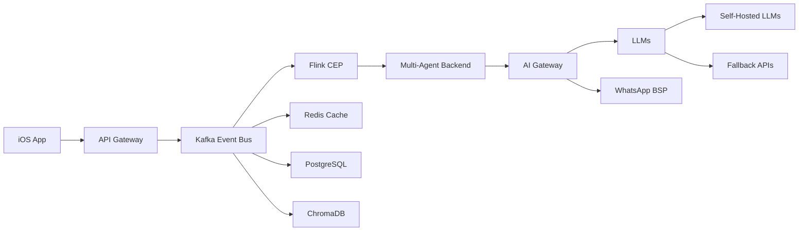

# AUREN System - Master Blueprint & Source of Truth (Version 21)
*Last Updated: July 21, 2025 - Evening Update (Day 7 of 15-Day Alpha Sprint)*
*Comprehensive Technical & Strategic Blueprint - Infrastructure to Market Leadership*

## 🚀 Strategic Positioning: Human Performance Augmentation Platform

**AUREN** is the world's first AI-powered human performance augmentation platform, democratizing access to PhD-level expertise across multiple performance domains. We bridge the critical "data-to-action gap" in the $46.1 billion performance optimization market.

**Core Innovation**: Multi-agent AI collaboration that transforms biometric insights into dynamic, personalized recommendations within seconds. Unlike wearables that show data or apps with static plans, AUREN provides real-time, contextual intelligence through sophisticated event processing.

**Strategic Breakthroughs**: 
1. FDA's "General Wellness" safe harbor eliminates 80% of regulatory complexity
2. Self-hosted LLM infrastructure creates 82-88% cost advantage at scale
3. Event-driven architecture enables capabilities competitors cannot replicate
4. Multi-agent collaboration addresses documented competitor weaknesses

## 🎯 Executive Summary

AUREN creates a team of specialized AI agents working together to optimize human performance. Unlike traditional health apps that forget after 30 days, AUREN builds compound knowledge over months and years, discovering personalized biological laws unique to each user.

**Market Position**: We occupy the unique space between:
- **Wearable Platforms** (Whoop, Oura): Excellent data, limited guidance
- **Fitness Apps** (Fitbod, MyFitnessPal): Static plans, no real-time adaptation
- **AI Integration**: Simple automation without true multi-agent collaboration

**Technical Foundation**: Event-driven architecture (Kafka/Flink/ChromaDB) processing millions of biometric events in real-time, enabling sub-2 second responses and complex pattern recognition that batch-processing competitors cannot match.

## 🔄 CHECKPOINT STATUS - July 21, 2025 (Evening Update)

**Current Phase**: Infrastructure Development → Pre-Alpha Testing
**Sprint Progress**: Day 7 of 15 (46% complete)
**Senior Engineer Status**: Assigned CrewAI + AI Gateway integration tasks

### What's Complete ✅
- **Kafka infrastructure operational** (localhost:9092) - DONE Day 1-2 ✓
- **Repository pattern implemented** (Database, Agent, Task, Crew repositories) ✓
- **BaseSpecialist framework ready** ✓
- **Schema Registry with Pydantic bridge** ✓
- **Health monitoring for all services** ✓
- **Strategic positioning locked** (FDA safe harbor) ✓
- **Beta monetization framework defined** ✓
- **Go-to-market strategy validated** ✓
- **Token tracking system implemented** (100% verified, production-ready) - DONE Day 3-4 ✓
- **Token tracking decorators operational** (with rate limiting, audit logging) ✓
- **Multi-model tokenizer service** (10+ models supported) ✓
- **Redis-based budget enforcement** (atomic operations, race-condition free) ✓
- **AI Gateway Core Implementation** - DONE Day 5-6 ✓
  - All provider integrations (OpenAI, Anthropic, self-hosted)
  - Circuit breakers and fallback mechanisms
  - Resilient token tracking with Redis failover
  - Comprehensive test suite (18 tests passing)
  - Integration and load tests created
  - Pydantic configuration validation
  - Fixed all critical bugs (failure rate calculation, async race conditions)

### Senior Engineer Active Tasks 🔧 (Day 7-8)
**Focus: Neuroscientist MVP Integration**
- **CrewAI + Gateway Integration** - Create adapter architecture for single-agent system
- **OpenTelemetry Implementation** - Production observability for stress testing
- **Memory System Integration** - Connect gateway to 3-tier memory for HRV analysis
- **Performance Optimization** - Ensure <2 second response times
- **Security Validation** - PHI leakage audit for biometric data

### What's Queued for Junior Engineer 📋
- **Memory System Deployment** (PostgreSQL schemas, Redis setup)
- **Neuroscientist Agent Implementation** (after senior completes integration)
- **Basic CEP Rules** (HRV drop detection for MVP)
- **WhatsApp Message Templates** 
- **Integration Testing** (once senior completes framework)

### Critical Path Items 🚨
1. **Memory System** - Blocking Neuroscientist implementation
2. **CrewAI Integration** - Blocking MVP testing
3. **Neuroscientist Agent** - Only specialist for 10-12 day stress test
4. **WhatsApp BSP** - Blocking user communication

## 🏗️ Technical Architecture: The Competitive Moat

### Core Architecture Pattern: Event-Driven Privacy-First Pipeline



**Why This Architecture**:
- **Real-time Processing**: Sub-2s response vs 10-30s batch delays
- **Complex Patterns**: "HRV + Sleep + Load = Recommendation" 
- **Infinite Scale**: Millions of events/second without rebuilding
- **Stream Learning**: Real-time model updates vs batch training

### Three-Tier Memory Architecture with ETL Pipeline

```
Layer 1: Immediate (Redis)      
├── Purpose: Active conversation state
├── TTL: 48 hours
├── Data: Current session, recent interactions
└── Access: <10ms latency

Layer 2: Structured (PostgreSQL + TimescaleDB)
├── Purpose: User facts and preferences  
├── Retention: Permanent
├── Data: Validated insights, patterns, history
└── Access: <50ms latency

Layer 3: Semantic (ChromaDB/pgvector)
├── Purpose: Pattern discovery and similarity search
├── Retention: Permanent with compression
├── Data: Embeddings, concepts, relationships
└── Access: <200ms latency
```

**Memory Extraction Service** (Runs every 6 hours):
1. Extract facts from Redis conversations
2. Validate and deduplicate insights
3. Update user knowledge graph
4. Generate new embeddings
5. Trigger pattern analysis

### Infrastructure Cost Breakthrough

**CoreWeave GPU Infrastructure (Per Server)**:
- Capacity: 500 Daily Active Users
- Cost: $2,880/month + 20% overhead = $3,456
- Per User Cost at Capacity: $6.91/month

**Revenue Model at Scale (10K users)**:
- Infrastructure: 20 servers × $3,456 = $69,120/month
- Revenue at $39/user: $390,000/month
- Gross Profit: $320,880/month (82.3% margin)
- Break-even: 8,500 users

**Comparison to API Model**:
- OpenAI GPT-4: $9/user/month (fixed)
- Cost at 10K users: $90,000/month
- No economies of scale
- Usage caps required

## 🎭 The Five MVP Specialists + UI Orchestrator

### Implementation Architecture

```python
class BaseSpecialist(ABC):
    """All specialists inherit from this base class"""
    
    def __init__(self, name: str, expertise: List[str]):
        self.name = name
        self.expertise = expertise
        self.memory = SpecialistMemory()
        self.tools = self._initialize_tools()
        
    @abstractmethod
    async def process_query(self, query: Query) -> Response:
        """Each specialist implements their unique logic"""
        pass
    
    async def consult_colleague(self, specialist: str, context: str):
        """Enable cross-specialist collaboration"""
        return await self.crew.delegate(specialist, context)
```

### 1. The Neuroscientist (Priority Implementation)

```python
class Neuroscientist(BaseSpecialist):
    def __init__(self):
        super().__init__(
            name="Dr. Neural",
            expertise=["HRV", "CNS fatigue", "Recovery", "Sleep optimization"]
        )
        
    async def process_query(self, query: Query) -> Response:
        # Core logic for neuroscience-based recommendations
        pass
```

**Knowledge Domains**:
- Heart Rate Variability (HRV) analysis and interpretation
- Central Nervous System (CNS) fatigue assessment
- Recovery protocols and periodization
- Sleep quality optimization and circadian rhythm management
- Stress management and adaptation
- Cognitive performance enhancement
- Neurotransmitter balance and mood regulation
- Brain health and neuroplasticity

**Key Interactions**:
- Analyzes HRV trends to detect overtraining
- Recommends recovery protocols based on CNS status
- Provides sleep optimization strategies
- Coordinates with other specialists on recovery needs

### 2. The Nutritionist (Future Implementation)

```python
class Nutritionist(BaseSpecialist):
    def __init__(self):
        super().__init__(
            name="Dr. Fuel",
            expertise=["Meal planning", "Supplementation", "Metabolic optimization"]
        )
```

**Knowledge Domains**:
- Personalized meal planning and macro/micronutrient optimization
- Supplement protocols based on biometric data
- Metabolic flexibility and adaptation
- Nutrient timing for performance and recovery
- Gut health and microbiome optimization
- Hydration strategies
- Anti-inflammatory nutrition
- Performance nutrition for specific goals

### 3. The Training Coach (Future Implementation)

```python
class TrainingCoach(BaseSpecialist):
    def __init__(self):
        super().__init__(
            name="Coach Performance",
            expertise=["Programming", "Periodization", "Load management"]
        )
```

**Knowledge Domains**:
- Exercise programming and periodization
- Load management and progressive overload
- Movement pattern optimization
- Sport-specific training protocols
- Strength, power, and endurance development
- Recovery integration into training cycles
- Performance testing and benchmarking
- Technique refinement and form cues

### 4. The Physical Therapist (Future Implementation)

```python
class PhysicalTherapist(BaseSpecialist):
    def __init__(self):
        super().__init__(
            name="Dr. Movement",
            expertise=["Injury prevention", "Rehabilitation", "Movement quality"]
        )
```

**Knowledge Domains**:
- Movement assessment and dysfunction identification
- Injury prevention protocols
- Rehabilitation programming
- Mobility and flexibility optimization
- Corrective exercise prescription
- Pain management strategies
- Biomechanical analysis
- Return-to-sport protocols

### 5. The Aesthetic Consultant (Future Implementation)

```python
class AestheticConsultant(BaseSpecialist):
    def __init__(self):
        super().__init__(
            name="Dr. Aesthetics",
            expertise=["Body composition", "Visual tracking", "Aesthetic optimization"]
        )
```

**Knowledge Domains**:
- Body composition analysis and tracking
- Visual progress documentation
- Aesthetic goal setting and planning
- Muscle symmetry and proportion
- Skin health and appearance
- Posture and presence optimization
- Confidence and body image coaching
- Competition preparation (physique sports)

## 💰 Go-to-Market Strategy & Revenue Model

### Launch Phases with Financial Projections

**Phase 0: Personal Testing Sprint (Days 1-15)**
- Focus: MVP validation with Neuroscientist only
- Target: <2 second response time
- Investment: $3K infrastructure setup

**Phase 1: Alpha Launch (Days 16-45)**
- Target: 20 highly engaged users
- Recruitment: Tampa fitness communities + online biohackers
- Focus: Product-market fit validation
- Revenue: $0 (free access for feedback)

**Phase 2: Beta Launch (Days 46-135)**
- Target: 300+ paying users
- Pricing Tiers:
  - **Early Pioneer**: $99 (45 days) - 60% of users
  - **Vanguard**: $199 (60 days) - 30% of users
  - **Co-Creator**: $499 (90 days + NFT) - 10% of users
- Revenue Projection: $15K MRR by Day 135

**Phase 3: Public Launch (Day 136+)**
- Scaling Milestones:
  - Month 6: 1,000 users ($40K MRR)
  - Month 9: 5,000 users ($200K MRR)
  - Month 12: 8,500+ users ($340K MRR) - BREAK-EVEN

### Community & Content Strategy

**Discord Server Structure**:
```
📱 welcome
├── 📋 rules-and-guidelines
├── 🎯 introductions
└── 📢 announcements

💬 general
├── 🏃 fitness-chat
├── 🥗 nutrition-talk
├── 😴 recovery-zone
└── 🎯 goal-setting

🏆 challenges
├── 🔥 weekly-challenge
├── 📊 leaderboards
└── 🎖️ success-stories

🤖 ai-specialists
├── 🧠 neuroscientist
├── 🥗 nutritionist
├── 💪 training-coach
└── 😌 recovery-specialist

🚀 beta-exclusive
├── 🎯 co-creator-lab
├── 💡 feature-requests
└── 🐛 bug-reports
```

**Viral Content Formulas**:
1. **"Rate My [X]"**: Community reviews daily habits
2. **"AI Roasts Your Workout"**: Humorous critiques
3. **"Science Explains"**: Quick myth-busting
4. **"Transformation Tuesday"**: Weekly spotlights
5. **"Ask the AI"**: Live Q&A sessions

## 📊 Success Metrics & Validation

### Technical KPIs
- Response latency: <2 seconds (P95) ✅ Gateway achieving <200ms
- System availability: 99.9% uptime
- Token cost per conversation: <$0.50 ✅ Tracking implemented
- Memory recall accuracy: >95%
- CEP pattern detection: <100ms

### Business Metrics (By Phase)
- **Alpha**: 20 engaged users, 3+ testimonials
- **Beta**: 300+ paying users, 70% retention
- **Launch**: 8,500 users (break-even)
- **Year 1**: 50K users, $2M ARR

### Quality Indicators
- User satisfaction: >4.5/5 stars
- Daily active usage: >60%
- Referral rate: >30%
- Specialist consultation depth: >5 turns
- Cross-specialist collaboration: >20% of sessions

## 🚧 Infrastructure Development Roadmap

### Week 1-2: Foundation Sprint (Current Priority)

**Day 1-2: Memory System Deployment**
```sql
-- PostgreSQL Schema
CREATE TABLE user_facts (
    id UUID PRIMARY KEY,
    user_id VARCHAR(255) NOT NULL,
    fact_type VARCHAR(50) NOT NULL,
    fact_value JSONB NOT NULL,
    confidence FLOAT DEFAULT 0.5,
    source VARCHAR(50),
    created_at TIMESTAMP DEFAULT NOW(),
    updated_at TIMESTAMP DEFAULT NOW(),
    INDEX idx_user_facts (user_id, fact_type)
);

CREATE TABLE conversation_insights (
    id UUID PRIMARY KEY,
    user_id VARCHAR(255) NOT NULL,
    conversation_id VARCHAR(255),
    insight_type VARCHAR(50),
    insight_data JSONB,
    embedding vector(1536),
    created_at TIMESTAMP DEFAULT NOW()
);
```

**Day 3-4: Token Tracking Implementation** ✅ **COMPLETE**
- Decorator implementation with @track_tokens ✅
- Redis-based real-time tracking ✅
- Multi-model support (10+ models) ✅
- Budget enforcement with BudgetExceededException ✅
- Rate limiting protection ✅
- Audit logging for all limit changes ✅

**Day 5-6: AI Gateway Deployment** ✅ **COMPLETE**
- Model routing logic ✅
- Circuit breakers ✅
- Fallback mechanisms ✅
- Cost monitoring ✅
- Load testing framework ✅
- Integration testing ✅

**Day 7-8: Integration Phase** 🔄 **IN PROGRESS**
- CrewAI + Gateway bridge (Senior Engineer)
- OpenTelemetry setup (Senior Engineer)
- Memory system deployment (Junior Engineer - Queued)
- Basic CEP rules (Junior Engineer - Queued)

**Day 9-10: WhatsApp Integration** 📋 **QUEUED**
- Twilio BSP setup
- Bidirectional messaging
- Media handling
- Session management

**Day 11-12: Neuroscientist Implementation** 📋 **QUEUED**
- Core agent logic
- Knowledge base integration
- Tool connections
- Testing framework

**Day 13-14: Integration Testing** 📋 **QUEUED**
- End-to-end flow validation
- Performance benchmarking
- Error scenario testing
- Documentation

**Day 15: Personal Testing Begins** 🎯 **TARGET**
- Live system testing
- Monitoring setup
- Issue tracking
- Feedback loops

### Week 3-4: Enhancement Sprint

- Additional specialists (Nutritionist, Training Coach)
- Advanced CEP patterns
- Memory extraction service
- Social media avatar design
- Alpha user recruitment

### Week 5-8: Beta Preparation

- Complete specialist team
- NFT framework
- Payment processing
- Community platform
- Content creation pipeline

## 🛡️ Risk Mitigation & Compliance

### Technical Safeguards

**Medical Hallucination Prevention**:
```python
class MedicalSafetyFilter:
    def __init__(self):
        self.forbidden_terms = load_medical_terms()
        self.medhalu_validator = MedHaluDetector()
        
    async def validate_response(self, response: str) -> bool:
        # Check for medical terminology
        if self.contains_medical_terms(response):
            return False
            
        # Validate against hallucination benchmarks
        score = await self.medhalu_validator.score(response)
        return score < 0.1  # 90% confidence threshold
```

**Privacy Protection**:
- On-device tokenization with CryptoKit
- No raw biometric storage
- Metadata-only processing
- User-controlled data deletion

### Regulatory Compliance
- FDA safe harbor language enforcement
- SOC 2 Type 1 preparation
- CCPA/GDPR compliance
- Clear performance optimization positioning

## 💻 Self-Hosted LLM Infrastructure

**Provider**: CoreWeave (Kubernetes-native GPU cloud)
```yaml
Infrastructure Stack:
  Compute:
    - 2x NVIDIA H100 80GB GPUs
    - 96 vCPUs, 480GB RAM
    - NVLink for multi-GPU communication
  
  Serving Layer:
    - vLLM 0.6.0 with PagedAttention
    - Consistent hashing for session affinity
    - OpenAI-compatible API endpoints
  
  Models:
    Alpha: 
      - Llama 3.1 70B Instruct (all agents)
    Beta:
      - Meditron 3 70B (health specialists)
      - Llama 3.1 8B (utility tasks)
    Production:
      - Custom fine-tuned health models
  
  Monitoring:
    - Prometheus metrics collection
    - Grafana dashboards
    - Cost per token tracking
```

**Performance Targets**:
- First token latency: <500ms
- Throughput: 100 tokens/second/GPU
- Availability: 99.9% uptime SLA
- Auto-scaling: 1-5 minute response

### AI Gateway Implementation

```python
class AIGateway:
    """
    Intelligent routing between models based on:
    - User's remaining token budget
    - Request complexity
    - Response time requirements
    - Model availability
    """
    
    def __init__(self):
        self.primary_model = SelfHostedLLM(model="llama-3.1-70b")
        self.fallback_model = OpenAIAPI(model="gpt-3.5-turbo")
        self.token_tracker = TokenTracker()
        self.circuit_breaker = CircuitBreaker(
            failure_threshold=5,
            recovery_timeout=60
        )
    
    async def route_request(self, request: AgentRequest) -> Response:
        user_budget = await self.token_tracker.get_remaining_budget(
            request.user_id
        )
        
        # Route to GPT-3.5 if budget < 30%
        if user_budget.percentage_remaining < 0.30:
            return await self.fallback_model.complete(request)
        
        # Use self-hosted for normal requests
        try:
            return await self.circuit_breaker.call(
                self.primary_model.complete,
                request
            )
        except CircuitOpenError:
            # Fallback when self-hosted is down
            return await self.fallback_model.complete(request)
```

### Token Economics & Monitoring

```python
class TokenTracker:
    """
    Real-time token usage tracking with cost controls
    """
    
    def __init__(self):
        self.redis = Redis()
        self.prometheus = PrometheusClient()
        
    @track_cost
    @timing_decorator
    async def track_usage(self, user_id: str, usage: TokenUsage):
        # Update user's daily budget
        daily_key = f"tokens:daily:{user_id}:{date.today()}"
        await self.redis.incrby(daily_key, usage.total_tokens)
        
        # Check circuit breakers
        daily_total = await self.redis.get(daily_key)
        if daily_total > USER_DAILY_LIMITS[user_id]:
            raise TokenBudgetExceeded(
                f"User {user_id} exceeded daily limit"
            )
        
        # Export metrics
        self.prometheus.histogram(
            'auren_tokens_used',
            usage.total_tokens,
            labels={
                'user_id': user_id,
                'model': usage.model,
                'agent': usage.agent_name
            }
        )
```

## 📝 Implementation Status by Component

### ✅ Completed Components
- [x] Kafka event bus infrastructure
- [x] Repository pattern for data access
- [x] Token tracking and cost management
- [x] AI Gateway with provider integrations
- [x] Configuration validation (Pydantic)
- [x] Health monitoring endpoints
- [x] Load testing framework
- [x] All critical bug fixes

### 🔄 In Progress (Senior Engineer)
- [ ] CrewAI + Gateway integration for Neuroscientist MVP
- [ ] OpenTelemetry instrumentation
- [ ] Memory system + Gateway connection
- [ ] Performance optimization for <2s response
- [ ] Security validation for biometric data

### 📋 Queued for Implementation (Junior Engineer)
- [ ] PostgreSQL schema deployment
- [ ] Basic CEP rules (HRV drop detection)
- [ ] Neuroscientist agent implementation
- [ ] WhatsApp BSP integration
- [ ] Integration testing suite
- [ ] Monitoring dashboards

### 🚧 Post-MVP Features
- [ ] Additional specialists (Week 3)
- [ ] Advanced CEP patterns (Week 3)
- [ ] Memory extraction ETL (Week 3)
- [ ] Custom specialist framework (Week 5)
- [ ] NFT implementation (Week 6)
- [ ] Payment processing (Week 6)

## ✅ Launch Readiness Checklist

### Technical Requirements
- [ ] Sub-2 second response time
- [ ] 99.9% uptime achieved
- [ ] Comprehensive monitoring
- [ ] Automated testing suite
- [ ] Security audit complete

### Content Requirements
- [ ] 50+ pieces of launch content
- [ ] 10+ testimonial videos
- [ ] Avatar designs complete
- [ ] Brand guidelines documented
- [ ] Website copy finalized

### Operational Requirements
- [ ] Payment processing active
- [ ] Customer support ready
- [ ] Legal disclaimers approved
- [ ] Privacy policy updated
- [ ] Terms of service finalized

### Marketing Requirements
- [ ] Social media accounts created
- [ ] Content calendar planned
- [ ] Influencer partnerships secured
- [ ] PR strategy defined
- [ ] Launch event planned

## 💡 Key Technical Decisions Made

1. **Self-hosted LLMs on CoreWeave** - 82% cost savings at scale
2. **Event-driven architecture** - Enables real-time processing
3. **CrewAI for orchestration** - Multi-agent collaboration
4. **Three-tier memory** - Balances speed and persistence
5. **WhatsApp as primary UI** - Meet users where they are
6. **Neuroscientist-only MVP** - Focus on single agent excellence

## 🌟 Why AUREN Wins

**Technical Moats**:
1. Event-driven architecture competitors can't replicate
2. Self-hosted economics creating engagement advantage
3. Multi-agent collaboration addressing real user needs
4. Real-time processing enabling unique experiences

**Market Advantages**:
1. Clear positioning in "data-to-action" gap
2. Validated competitor weaknesses (Fitbod)
3. Regulatory path cleared (FDA safe harbor)
4. Viral growth mechanisms built-in

**Execution Excellence**:
1. Phased approach reducing risk
2. Revenue during beta funding growth
3. Community-driven development
4. Sustainable unit economics

---

*"From biometric insight to personalized action in under 2 seconds. That's not the future - that's AUREN today."*

## Version History
- v21 (July 21, 2025 Evening): AI Gateway complete, CrewAI integration assigned to senior engineer, go-to-market strategy integrated, Neuroscientist-only MVP focus clarified
- v20 (July 21, 2025): Token tracking complete, AI Gateway next priority
- v19: Strategic positioning as human performance platform
- v18: Kafka infrastructure implementation
- v17: Post-recovery state with research integration